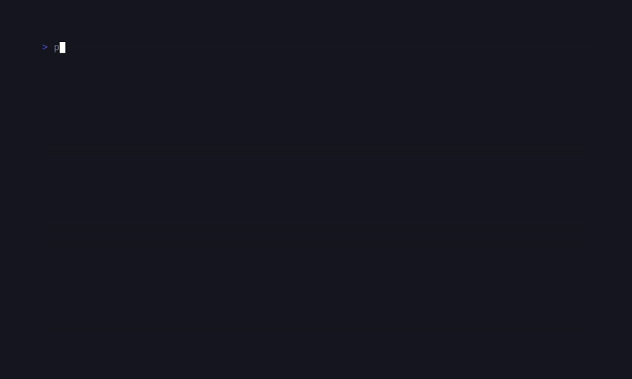

# SugarTick

<!-- BADGES:BEGIN -->
[](https://github.com/detain/sugarcraft/actions/workflows/ci.yml)
[](https://app.codecov.io/gh/detain/sugarcraft?flags%5B0%5D=sugar-tick)
[](https://packagist.org/packages/candycore/sugar-tick)
[](LICENSE)
[](https://www.php.net/)
<!-- BADGES:END -->




Privacy-first coding-time tracker — port of [`Rtarun3606k/TakaTime`](https://github.com/Rtarun3606k/TakaTime). Storage is JSONL on local disk (no cloud, no MongoDB), the dashboard is a SugarCharts-driven TUI that reads it.

## Run it

```bash
# write a heartbeat from your editor (one-shot CLI):
sugar-tick push <project> <language> <file> [duration]

# open the dashboard:
sugar-tick
```

By default heartbeats land in `$XDG_DATA_HOME/sugar-tick` (or
`~/.local/share/sugar-tick`). Override with `SUGARTICK_DIR=...`.

## Keys (dashboard)

| Key            | Action                       |
|----------------|------------------------------|
| `←`            | Shift the 7-day window back  |
| `→`            | Shift forward (to today)     |
| `r`            | Reload from disk             |
| `q` / `Esc`    | Quit                         |

## Architecture

| File          | Role                                                                          |
|---------------|-------------------------------------------------------------------------------|
| `Heartbeat`   | Value object — one activity sample (project, language, file, duration).       |
| `Store`       | JSONL-backed reader / appender. One file per day under the data dir.          |
| `Stats`       | Pure folder — totals per project / language + per-day timeline buckets.       |
| `Dashboard`   | CandyCore Model — renders the report, ←/→ shifts the window, r reloads.       |
| `Renderer`    | View — header + ranking panes side-by-side + Sparkline timeline (SugarCharts).|

The Store is intentionally append-only at the file level, so editor plug-ins can `>>` echo a JSON line directly without coordinating with the dashboard. The dashboard reads at `r` / on launch / when the day shifts — never holds a file lock.

## Test

```bash
composer install
vendor/bin/phpunit
```
