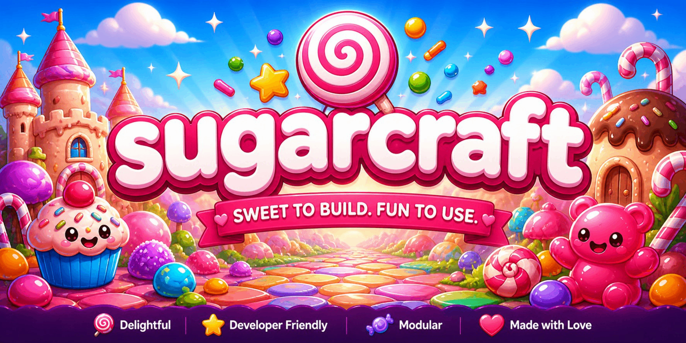

# SugarCraft

<p align="center">
  
</p>

PHP ports of the [Charmbracelet](https://charm.sh) TUI ecosystem (plus
[bubblezone](https://github.com/lrstanley/bubblezone),
[ntcharts](https://github.com/NimbleMarkets/ntcharts), and a small
SugarCraft-flavoured sweetshop of original libraries) — composer-installable,
PHP 8.1+, async on ReactPHP.

🌐 **Website:** [sugarcraft.github.io](https://sugarcraft.github.io/) — library matrix, quickstart, comparison page.

```sh
composer require candycore/candycore
```

## What's in the box

Sixteen libraries grouped by layer:

| | Library | Source counterpart | Role |
|---|---|---|---|
|  | **[CandyCore](candy-core/)** | [bubbletea](https://github.com/charmbracelet/bubbletea) | Elm-architecture TUI runtime — `Model` / `Msg` / `Cmd` / `Program` (incl. cursed cell-diff renderer) |
|  | **[CandySprinkles](candy-sprinkles/)** | [lipgloss](https://github.com/charmbracelet/lipgloss) | Declarative styling + layout — `Style`, `Border`, `Table`, `List`, `Tree`, `Layout::join`, `Place`, `Canvas` (multi-layer compositor) |
|  | **[HoneyBounce](honey-bounce/)** | [harmonica](https://github.com/charmbracelet/harmonica) | Damped spring physics + Newtonian projectile sim |
|  | **[CandyZone](candy-zone/)** | [bubblezone](https://github.com/lrstanley/bubblezone) | Mouse-zone tracker — wrap rendered chunks, get back bounding boxes |
|  | **[SugarBits](sugar-bits/)** | [bubbles](https://github.com/charmbracelet/bubbles) | 14 components: TextInput, TextArea, ItemList, Table, Viewport, FilePicker, Progress, Spinner, Cursor, Help, Key, Paginator, Stopwatch, Timer |
|  | **[SugarCharts](sugar-charts/)** | [ntcharts](https://github.com/NimbleMarkets/ntcharts) | Canvas + Sparkline, Bar, Line, Heatmap, Scatter, TimeSeries, Streamline, Waveline, OHLC, Picture (Sixel/Kitty/iTerm2) |
|  | **[SugarPrompt](sugar-prompt/)** | [huh](https://github.com/charmbracelet/huh) | Form library — Note, Input, Confirm, Select, MultiSelect, Text, FilePicker; multi-page Groups; 6 themes |
|  | **[CandyShell](candy-shell/)** | [gum](https://github.com/charmbracelet/gum) | Composer-installable CLI of all 13 subcommands (choose, confirm, file, filter, format, input, join, log, pager, spin, style, table, write) |
|  | **[CandyShine](candy-shine/)** | [glamour](https://github.com/charmbracelet/glamour) | Markdown → ANSI renderer with word-wrap, OSC 8 hyperlinks, 8 themes |
|  | **[CandyKit](candy-kit/)** | [fang](https://github.com/charmbracelet/fang) | CLI presentation helpers — StatusLine, Banner, Section, Stage, HelpText |
|  | **[CandyFreeze](candy-freeze/)** | [freeze](https://github.com/charmbracelet/freeze) | Code → SVG screenshot generator (no `ext-gd` required) |
|  | **[SugarGlow](sugar-glow/)** | [glow](https://github.com/charmbracelet/glow) | Markdown CLI viewer / pager |
|  | **[SugarSpark](sugar-spark/)** | [sequin](https://github.com/charmbracelet/sequin) | ANSI escape-sequence inspector |
|  | **[CandyWish](candy-wish/)** | [wish](https://github.com/charmbracelet/wish) | SSH server middleware — Logger, Auth, RateLimit, BubbleTea (mount a CandyCore Program over `ForceCommand`) |
|  | **[SugarWishlist](sugar-wishlist/)** | [wishlist](https://github.com/charmbracelet/wishlist) | TUI directory of SSH endpoints — YAML/JSON config + `pcntl_exec` into the chosen `ssh` |
|  | **[CandyMetrics](candy-metrics/)** | [promwish](https://github.com/charmbracelet/promwish) | Telemetry primitives — counters, gauges, histograms with InMemory / JSON / StatsD / Prometheus textfile / Multi backends, plus a CandyWish session middleware |

## Apps built on the stack

| | App | Source counterpart | Role |
|---|---|---|---|
|  | **[CandyMold](candy-mold/)** | [bubbletea-app-template](https://github.com/charmbracelet/bubbletea-app-template) | `composer create-project candycore/candy-mold my-app` — bootstrap skeleton with a working counter Model |
|  | **[CandyTetris](candy-tetris/)** | [tetrigo](https://github.com/Broderick-Westrope/tetrigo) | Tetris clone — SRS rules, 7-bag, ghost piece, NES scoring, level-driven gravity |
|  | **[SuperCandy](super-candy/)** | [superfile](https://github.com/yorukot/superfile) | Dual-pane file manager — Midnight Commander style, multi-select, sort, delete-with-confirm |
|  | **[SugarCrush](sugar-crush/)** | [crush](https://github.com/charmbracelet/crush) | AI coding-assistant chat shell — pluggable backend (EchoBackend offline; CommandBackend for Anthropic / OpenAI / Ollama via a wrapper script) |
|  | **[SugarStash](sugar-stash/)** | [lazygit](https://github.com/jesseduffield/lazygit) | Three-pane git TUI — status / branches / log, single-key stage / unstage; shells out to `git` for every mutation |
|  | **[CandyQuery](candy-query/)** | [lazysql](https://github.com/jorgerojas26/lazysql) | Terminal SQLite browser — list tables, browse rows, run ad-hoc queries (PDO + `:memory:` test fixtures) |
|  | **[SugarTick](sugar-tick/)** | [TakaTime](https://github.com/Rtarun3606k/TakaTime) | Privacy-first coding-time tracker — JSONL on disk, SugarCharts-driven dashboard, no cloud / no MongoDB |
|  | **[CandyMines](candy-mines/)** | [go-sweep](https://github.com/maxpaulus43/go-sweep) | Minesweeper — first-click safety, recursive flood-fill, flag toggle, win/lose detection, deterministic-RNG injectable |
|  | **[CandyFlip](candy-flip/)** | [gifterm](https://github.com/namzug16/gifterm) | ASCII GIF viewer — ext-gd decode, downsample to a cell grid, render as ANSI 24-bit blocks or a luminance-ramp |
|  | **[HoneyFlap](honey-flap/)** | [flapioca](https://github.com/kbrgl/flapioca) | Flappy-Bird-style game — bird motion is a HoneyBounce projectile, pipes scroll left at a fixed cell rate |

Each library has its own `README.md` with usage examples and a deep dive into
its public API.

## Quickstart — a counter app

```php
use CandyCore\Core\{Cmd, KeyType, Model, Msg, Program};
use CandyCore\Core\Msg\KeyMsg;

final class Counter implements Model
{
    public function __construct(public readonly int $n = 0) {}
    public function init(): ?\Closure { return null; }

    public function update(Msg $msg): array
    {
        if ($msg instanceof KeyMsg && $msg->type === KeyType::Char && $msg->rune === 'q') {
            return [$this, Cmd::quit()];
        }
        return [
            $msg instanceof KeyMsg && $msg->type === KeyType::Up
                ? new self($this->n + 1)
                : ($msg instanceof KeyMsg && $msg->type === KeyType::Down
                    ? new self($this->n - 1)
                    : $this),
            null,
        ];
    }

    public function view(): string { return "n = {$this->n}\n↑ ↓ to count, q to quit\n"; }
}

(new Program(new Counter()))->run();
```

## Architecture

- **PHP 8.1+** — fibers, readonly props, enums, `match`, intersection types.
- **Runtime**: ReactPHP event loop. Mirrors goroutine semantics for input,
  signals, render tick, command execution.
- **Style**: PSR-12 + readonly DTOs. Every `Style`, `Model`, etc. is
  immutable — `with*()` returns a new instance.
- **Testing**: PHPUnit 10. Snapshot ANSI tests for renderers; scripted-input
  event tests for the runtime.
- **Layout**: monorepo during the porting phase. Each library will split
  into its own repo at v1.0.

## Status

Every library in the table above is **at v1**. The full surface of every Go
counterpart that PHP can reasonably express (modulo the niche items called
out in `CONVERSION.md` § Phase audit) has been ported. See
[CONVERSION.md](./CONVERSION.md) for the full roadmap, per-library status,
and the v2-parity sweep against Bubble Tea v2 / Lipgloss v2 / Bubbles v2.

## Running the test suites

The umbrella package is a metapackage; each library has its own
`composer.json` + `vendor/`. To test everything:

```sh
for d in candy-core candy-sprinkles honey-bounce candy-zone sugar-bits \
         sugar-charts sugar-prompt candy-shell candy-shine candy-kit \
         candy-freeze sugar-glow sugar-spark \
         candy-wish sugar-wishlist candy-metrics \
         candy-mold candy-tetris super-candy sugar-crush \
         sugar-stash candy-query sugar-tick candy-mines candy-flip honey-flap; do
    (cd "$d" && composer install --quiet && vendor/bin/phpunit) || exit 1
done
```

## Contributing

See [CONTRIBUTING.md](./CONTRIBUTING.md). Bugs, feature requests, and
ports of additional Charmbracelet (or compatible) libraries welcome.
For security issues, see [SECURITY.md](./SECURITY.md).

## License

[MIT](./LICENSE).
