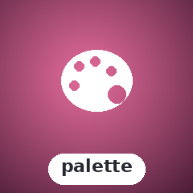
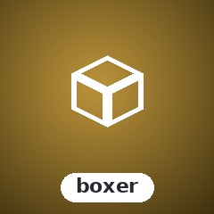
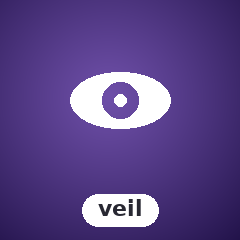
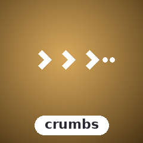
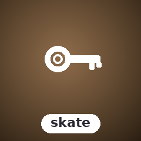

# SugarCraft

<p align="center">
  
</p>

<!-- BADGES:BEGIN -->
[](https://github.com/detain/sugarcraft/actions/workflows/ci.yml)
[](https://github.com/detain/sugarcraft/actions/workflows/pty-matrix.yml)
[](https://app.codecov.io/gh/detain/sugarcraft)
[](LICENSE)
[](https://www.php.net/)
[](CONTRIBUTING.md)
<!-- BADGES:END -->

PHP ports of the [Charmbracelet](https://charm.sh) TUI ecosystem (plus
[bubblezone](https://github.com/lrstanley/bubblezone),
[ntcharts](https://github.com/NimbleMarkets/ntcharts), and a small
SugarCraft-flavoured sweetshop of original libraries) — composer-installable,
PHP 8.1+, async on ReactPHP.

🌐 **Website:** [sugarcraft.github.io](https://sugarcraft.github.io/) — library matrix, quickstart, comparison page.

```sh
composer require sugarcraft/sugarcraft
```

## What's in the box

Fifty libraries grouped by layer:

| | Library | Role |
|---|---|---|
|  | **[SugarCraft](candy-core/)** | Elm-architecture TUI runtime — `Model` / `Msg` / `Cmd` / `Program` (incl. cursed cell-diff renderer). Port of [bubbletea](https://github.com/charmbracelet/bubbletea). |
|  | **[CandyAnsi](candy-ansi/)** | ECMA-48 VT500 state machine — ANSI byte-stream parser with abstract Handler interface. Extraction from candy-vt. |
|  | **[CandyBuffer](candy-buffer/)** | Cell-grid value objects — immutable Buffer (2-D cell grid) and Cell (rune/style/link/width). Shared foundation for all rendering; Buffer::diff() ships in step-26. |
|  | **[CandyAsync](candy-async/)** | Shared async vocabulary — CancellationToken, Subscriptions, AsyncOps helpers (withTimeout, retry, debounce, throttle). Pioneering — no upstream parallel. |
|  | **[CandySprinkles](candy-sprinkles/)** | Declarative styling + layout — `Style`, `Border`, `Table`, `List`, `Tree`, `Layout::join`, `Place`, `Canvas` (multi-layer compositor). Port of [lipgloss](https://github.com/charmbracelet/lipgloss). |
|  | **[CandyTesting](candy-testing/)** | Test harness for TEA programs — ProgramSimulator, golden-file assertions, snapshot helpers. Pioneering what bubble-tea issue #1654 never shipped. |
|  | **[HoneyBounce](honey-bounce/)** | Damped spring physics + Newtonian projectile sim. Port of [harmonica](https://github.com/charmbracelet/harmonica). |
|  | **[CandyZone](candy-zone/)** | Mouse-zone tracker — wrap rendered chunks, get back bounding boxes. Port of [bubblezone](https://github.com/lrstanley/bubblezone). |
|  | **[SugarBits](sugar-bits/)** | 14 components: TextInput, TextArea, ItemList, Table, Viewport, FilePicker, Progress, Spinner, Cursor, Help, Key, Paginator, Stopwatch, Timer. Port of [bubbles](https://github.com/charmbracelet/bubbles). |
|  | **[CandyVt](candy-vt/)** | Virtual terminal emulator — ANSI byte stream → cell grid + cursor + mode state. Port of [charmbracelet/x/vt](https://github.com/charmbracelet/x/tree/main/vt). |
|  | **[CandyVcr](candy-vcr/)** | Record + replay candy-core sessions — JSONL/YAML cassettes, `Program::withRecorder()`, `Player` with byte + cell-grid assertions, CLI. Port of [charmbracelet/x/vcr](https://github.com/charmbracelet/x/tree/main/vcr). |
|  | **[CandyPty](candy-pty/)** | Pseudo-terminal primitive — `Pty::open()` master/slave round-trip via FFI to libc; spawn/resize/non-blocking I/O land in PR2-PR5. Linux + macOS only. Port of [charmbracelet/x/xpty](https://github.com/charmbracelet/x/tree/main/xpty). |
|  | **[CandyForms](candy-forms/)** | Foundation lib for form primitives — TextInput, TextArea, ItemList, Viewport, FilePicker, Field interface, Confirm, Form (extracted from sugar-bits + sugar-prompt). |
|  | **[SugarCharts](sugar-charts/)** | Canvas + Sparkline, Bar, Line, Heatmap, Scatter, TimeSeries, Streamline, Waveline, OHLC, Picture (Sixel/Kitty/iTerm2). Port of [ntcharts](https://github.com/NimbleMarkets/ntcharts). |
|  | **[SugarPrompt](sugar-prompt/)** | Form library — Note, Input, Confirm, Select, MultiSelect, Text, FilePicker; multi-page Groups; 6 themes. Port of [huh](https://github.com/charmbracelet/huh). |
|  | **[CandyShine](candy-shine/)** | Markdown → ANSI renderer with word-wrap, OSC 8 hyperlinks, 8 themes. Port of [glamour](https://github.com/charmbracelet/glamour). |
|  | **[CandyKit](candy-kit/)** | CLI presentation helpers — StatusLine, Banner, Section, Stage, HelpText. Port of [fang](https://github.com/charmbracelet/fang). |
|  | **[CandyWish](candy-wish/)** | SSH server middleware — Logger, Auth, RateLimit, BubbleTea (mount a SugarCraft Program over `ForceCommand`). Port of [wish](https://github.com/charmbracelet/wish). |
|  | **[CandyMetrics](candy-metrics/)** | Telemetry primitives — counters, gauges, histograms with InMemory / JSON / StatsD / Prometheus textfile / Multi backends, plus a CandyWish session middleware. Port of [promwish](https://github.com/charmbracelet/promwish). |
|  | **[CandyLog](candy-log/)** | Colorful leveled logger — Debug / Info / Warn / Error / Fatal with structured context, Text / JSON / Logfmt formatters, sub-loggers, and StandardLogAdapter. Port of [log](https://github.com/charmbracelet/log) |
|  | **[CandyPalette](candy-palette/)** | Terminal color profile detection + ANSI / ANSI256 / TrueColor conversion. StandardColors and ProfileWriter. Port of [colorprofile](https://github.com/charmbracelet/colorprofile) |
|  | **[CandyLister](candy-lister/)** | Tree/list view with box-drawing prefixes, cursor navigation, word-wrap, and filter-as-you-type. Port of [bubblelister](https://github.com/treilik/bubblelister) |
|  | **[SugarBoxer](sugar-boxer/)** | Box-drawing layout engine — H/V panel composition with weighted sizing, borders, and nested grids. Port of [bubbleboxer](https://github.com/treilik/bubbleboxer) |
|  | **[SugarVeil](sugar-veil/)** | Terminal overlay compositor — push/pop overlay views with z-ordering, positioning, and per-overlay teardown. Port of [bubbletea-overlay](https://github.com/rmhubbert/bubbletea-overlay) |
|  | **[SugarCrumbs](sugar-crumbs/)** | Navigation breadcrumbs — immutable NavStack with push/pop, shell-change detection, and type-ahead filter. Port of [bubbleo](https://github.com/KevM/bubbleo) |
|  | **[SugarDash](sugar-dash/)** | Dashboard TUI library — column grid layout, framed panels, status bar, tabs, and more. Port of [bubble-grid](https://github.com/charmbracelet/bubble-grid). |
|  | **[CandyHermit](candy-hermit/)** | Fuzzy finder overlay — type to filter a list, arrow keys to select, Enter to confirm. Bubbletea Model wrapper. Port of [theHermit](https://github.com/Genekkion/theHermit) |
|  | **[SugarStickers](sugar-stickers/)** | FlexBox layout engine + simple sort/filter table. Ratio-based sizing, gap, justify, align, per-column styling. Port of [stickers](https://github.com/76creates/stickers) |
|  | **[SugarToast](sugar-toast/)** | Floating notification overlays — Info / Success / Warning / Error types, configurable position and auto-dismiss. Port of [bubbleup](https://github.com/DaltonSW/bubbleup) |
|  | **[SugarCalendar](sugar-calendar/)** | Interactive month-grid date picker — keyboard navigation, min/max date constraints, locale day names, ANSI rendering. Port of [bubble-datepicker](https://github.com/EthanEFung/bubble-datepicker) |
|  | **[SugarReadline](sugar-readline/)** | Interactive prompts — Text, Confirm, Selection, MultiSelect, Textarea. State-machine model, no external readline dependency. Port of [promptkit](https://github.com/erikgeiser/promptkit) |
|  | **[SugarTable](sugar-table/)** | Full-featured interactive data table — column definitions, StyledCell ANSI formatting, pagination, frozen rows/cols. Port of [bubble-table](https://github.com/Evertras/bubble-table) |

## Apps built on the stack

| | App | Role |
|---|---|---|
|  | **[CandyMold](candy-mold/)** | `composer create-project sugarcraft/candy-mold my-app` — bootstrap skeleton with a working counter Model. Port of [bubbletea-app-template](https://github.com/charmbracelet/bubbletea-app-template). |
|  | **[CandyShell](candy-shell/)** | Composer-installable CLI of all 13 subcommands (choose, confirm, file, filter, format, input, join, log, pager, spin, style, table, write). Port of [gum](https://github.com/charmbracelet/gum). |
|  | **[CandyFreeze](candy-freeze/)** | Code → SVG screenshot generator (no `ext-gd` required). Port of [freeze](https://github.com/charmbracelet/freeze). |
|  | **[SugarGlow](sugar-glow/)** | Markdown CLI viewer / pager. Port of [glow](https://github.com/charmbracelet/glow). |
|  | **[SugarSpark](sugar-spark/)** | ANSI escape-sequence inspector. Port of [sequin](https://github.com/charmbracelet/sequin). |
|  | **[SugarWishlist](sugar-wishlist/)** | TUI directory of SSH endpoints — YAML/JSON config + `pcntl_exec` into the chosen `ssh`. Port of [wishlist](https://github.com/charmbracelet/wishlist). |
|  | **[SugarSkate](sugar-skate/)** | In-memory key/value store with plugin backends — Memory, SQLite, Badger. Glob listing, TTL, batch operations. Port of [skate](https://github.com/charmbracelet/skate) |
|  | **[SugarPost](sugar-post/)** | Email sending library — SMTP + Resend API transports, attachments, HTML + plain-text multipart, fluent interface. Port of [skate](https://github.com/charmbracelet/skate) |
|  | **[CandyServe](candy-serve/)** | Self-hostable Git server over SSH (authorized keys), Git daemon, and HTTP. Users, repos, access control, optional LFS. Port of [soft-serve](https://github.com/charmbracelet/soft-serve) |
|  | **[CandyTetris](candy-tetris/)** | Tetris clone — SRS rules, 7-bag, ghost piece, NES scoring, level-driven gravity. Port of [tetrigo](https://github.com/Broderick-Westrope/tetrigo). |
|  | **[SuperCandy](super-candy/)** | Dual-pane file manager — Midnight Commander style, multi-select, sort, delete-with-confirm. Port of [superfile](https://github.com/yorukot/superfile). |
|  | **[SugarCrush](sugar-crush/)** | AI coding-assistant chat shell — pluggable backend (EchoBackend offline; CommandBackend for Anthropic / OpenAI / Ollama via a wrapper script). Port of [crush](https://github.com/charmbracelet/crush). |
|  | **[SugarStash](sugar-stash/)** | Three-pane git TUI — status / branches / log, single-key stage / unstage; shells out to `git` for every mutation. Port of [lazygit](https://github.com/jesseduffield/lazygit). |
|  | **[CandyQuery](candy-query/)** | Terminal SQLite browser — list tables, browse rows, run ad-hoc queries (PDO + `:memory:` test fixtures). Port of [lazysql](https://github.com/jorgerojas26/lazysql). |
|  | **[SugarTick](sugar-tick/)** | Privacy-first coding-time tracker — JSONL on disk, SugarCharts-driven dashboard, no cloud / no MongoDB. Port of [TakaTime](https://github.com/Rtarun3606k/TakaTime). |
|  | **[CandyMines](candy-mines/)** | Minesweeper — first-click safety, recursive flood-fill, flag toggle, win/lose detection, deterministic-RNG injectable. Port of [go-sweep](https://github.com/maxpaulus43/go-sweep). |
|  | **[CandyFlip](candy-flip/)** | ASCII GIF viewer — ext-gd decode, downsample to a cell grid, render as ANSI 24-bit blocks or a luminance-ramp. Port of [gifterm](https://github.com/namzug16/gifterm). |
|  | **[SugarReel](sugar-reel/)** | Terminal video player — decodes mp4 (and more) on the fly and renders to ASCII / ANSI / truecolor half-block / sixel / kitty. Prior art: [tplay](https://github.com/maxcurzi/tplay), [glyph](https://github.com/seatedro/glyph), [video-to-ascii](https://github.com/joelibaceta/video-to-ascii). |
|  | **[HoneyFlap](honey-flap/)** | Flappy-Bird-style game — bird motion is a HoneyBounce projectile, pipes scroll left at a fixed cell rate. Port of [flapioca](https://github.com/kbrgl/flapioca). |

Each library has its own `README.md` with usage examples and a deep dive into
its public API.

## Quickstart — a counter app

```php
use SugarCraft\Core\{Cmd, KeyType, Model, Msg, Program};
use SugarCraft\Core\Msg\KeyMsg;

final class Counter implements Model
{
    public function __construct(public readonly int $n = 0) {}
    public function init(): ?\Closure { return null; }

    public function update(Msg $msg): array
    {
        if ($msg instanceof KeyMsg && $msg->type === KeyType::Char && $msg->rune === 'q') {
            return [$this, Cmd::quit()];
        }
        return [
            $msg instanceof KeyMsg && $msg->type === KeyType::Up
                ? new self($this->n + 1)
                : ($msg instanceof KeyMsg && $msg->type === KeyType::Down
                    ? new self($this->n - 1)
                    : $this),
            null,
        ];
    }

    public function view(): string { return "n = {$this->n}\n↑ ↓ to count, q to quit\n"; }
}

(new Program(new Counter()))->run();
```

## Architecture

- **PHP 8.1+** — fibers, readonly props, enums, `match`, intersection types.
- **Runtime**: ReactPHP event loop. Mirrors goroutine semantics for input,
  signals, render tick, command execution.
- **Style**: PSR-12 + readonly DTOs. Every `Style`, `Model`, etc. is
  immutable — `with*()` returns a new instance.
- **Testing**: PHPUnit 10. Snapshot ANSI tests for renderers; scripted-input
  event tests for the runtime.
- **Layout**: monorepo during the porting phase. Each library will split
  into its own repo at v1.0.

## Status

Every library in the table above is **at v1**. The full surface of every Go
counterpart that PHP can reasonably express (modulo the niche items called
out in `CONVERSION.md` § Phase audit) has been ported. See
[CONVERSION.md](./CONVERSION.md) for the full roadmap, per-library status,
and the v2-parity sweep against Bubble Tea v2 / Lipgloss v2 / Bubbles v2.

## Adding a new library or app

The matchup of upstream → SugarCraft port is the source-of-truth in
[MATCHUPS.md](./MATCHUPS.md), and the contributor / agent playbook in
[AGENTS.md](./AGENTS.md) walks through the full integration: naming
conventions, package skeleton, tests, examples, VHS demos, website
tiles, and the central docs to update. AI assistants should read
AGENTS.md first.

## Running the test suites

The umbrella package is a metapackage; each library has its own
`composer.json` + `vendor/`. To test everything:

```sh
for d in candy-core candy-ansi candy-buffer candy-layout candy-async candy-testing candy-mouse candy-input candy-fuzzy candy-sprinkles honey-bounce candy-zone candy-forms \
         sugar-bits sugar-charts sugar-dash sugar-prompt candy-shell candy-shine candy-kit \
         candy-freeze sugar-glow sugar-spark \
         candy-wish sugar-wishlist candy-metrics \
         candy-mold candy-tetris super-candy sugar-crush \
         sugar-stash candy-query sugar-tick candy-mines candy-flip honey-flap; do
     (cd "$d" && composer install --quiet && vendor/bin/phpunit) || exit 1
done
```

Code style is enforced via `php-cs-fixer` (root `.php-cs-fixer.dist.php`). Run from the repo root:

```sh
PHP_CS_FIXER_IGNORE_ENV=1 php-cs-fixer fix --diff --allow-risky=yes
```

## Contributing

See [CONTRIBUTING.md](./CONTRIBUTING.md). Bugs, feature requests, and
ports of additional Charmbracelet (or compatible) libraries welcome.
For security issues, see [SECURITY.md](./SECURITY.md).

## License

[MIT](./LICENSE).

---

<p align="center">
  <a href="https://sugarcraft.github.io/"></a><br>
  <em>made with sugar · sweet to build · fun to use</em>
</p>
