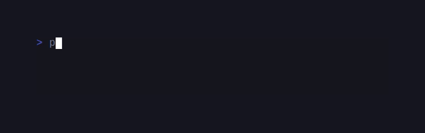
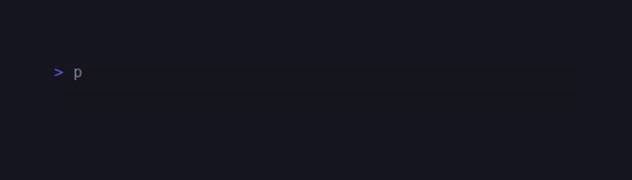

# CandyCore

<!-- BADGES:BEGIN -->
[](https://github.com/detain/sugarcraft/actions/workflows/ci.yml)
[](https://app.codecov.io/gh/detain/sugarcraft?flags%5B0%5D=candy-core)
[](https://packagist.org/packages/candycore/candy-core)
[](LICENSE)
[](https://www.php.net/)
<!-- BADGES:END -->




PHP port of [charmbracelet/bubbletea](https://github.com/charmbracelet/bubbletea) —
the Elm-architecture TUI runtime at the heart of the Charmbracelet stack.

```php
use CandyCore\Core\{Cmd, KeyType, Model, Msg, Program};
use CandyCore\Core\Msg\{KeyMsg, WindowSizeMsg};

final class Counter implements Model
{
    public function __construct(public readonly int $count = 0) {}
    public function init(): ?\Closure { return null; }

    public function update(Msg $msg): array
    {
        if ($msg instanceof KeyMsg) {
            return match (true) {
                $msg->type === KeyType::Char && $msg->rune === 'q' => [$this, Cmd::quit()],
                $msg->type === KeyType::Up    => [new self($this->count + 1), null],
                $msg->type === KeyType::Down  => [new self($this->count - 1), null],
                default => [$this, null],
            };
        }
        return [$this, null];
    }

    public function view(): string { return "count: $this->count\n(↑/↓ to change, q to quit)"; }
}

(new Program(new Counter()))->run();
```

## Requirements

- PHP 8.1+
- `mbstring`, `intl` (for grapheme width)
- `pcntl` (signal handling — POSIX only)
- `react/event-loop` ^1.6 (Composer)

## Architecture

- **`Model`** — your app implements `init()`, `update(Msg)`, `view()`.
- **`Msg`** — marker interface for events. Built-ins: `KeyMsg`, `WindowSizeMsg`, `QuitMsg`.
- **`Cmd`** — `Closure(): ?Msg`. Async work whose result is dispatched as a Msg. Helpers in `Cmd::quit()`, `Cmd::batch()`, `Cmd::send()`.
- **`Program`** — orchestrator. Sets up TTY, runs the ReactPHP event loop, dispatches Msgs, drives renders at the configured framerate.
- **`InputReader`** — stateful byte-stream parser; handles split escape sequences across reads.
- **`Renderer`** — minimal cursor-home + erase + write. Diff-based renderer is a follow-up.
- **`Util/`** — `Ansi`, `Color`, `ColorProfile`, `Width`, `Tty` foundation utilities, shared with CandySprinkles.

## Demos

### Counter Model


### Timer




## Status

- **Phase 0** (foundation utilities): 🟢 complete.
- **Phase 3** (runtime): 🟢 v1 — Program loop, mouse (cell-motion + all-motion + SGR 1006), focus / blur, bracketed paste, full function-key set including F13–F63 and the Kitty PUA range, the cell-diff "cursed" renderer (synchronized output 2026 + unicode mode 2027), inline-mode rendering, declarative `View` struct, plus the v2 Cmd surface (`Suspend` / `Interrupt` / `Resume` / `Exec` / `Sequence` / `Every` / `Printf` / `Raw` / `wait` / `kill` / `releaseTerminal` / `restoreTerminal`).

See [../CONVERSION.md](../CONVERSION.md) for the full roadmap and the
[v2 parity sweep](../CONVERSION.md#phase-11--v2-parity-sweep-bubble-tea--lipgloss--bubbles)
table tracking each Bubble Tea v2 / Lipgloss v2 / Bubbles v2
feature.

## Companion libraries

CandyCore is the foundation — the rest of the SugarCraft stack
builds on it. From the same monorepo:

- **CandySprinkles** (← lipgloss) — declarative styling + layout.
- **SugarBits** (← bubbles) — 14 prebuilt components.
- **SugarPrompt** (← huh) — multi-page form library.
- **SugarCharts** (← ntcharts) — sparkline / bar / line / heatmap / OHLC.
- **CandyShell** (← gum) — composer-installable CLI of 13 subcommands.
- **CandyShine** (← glamour) — Markdown → ANSI renderer.
- **CandyZone** (← bubblezone) — mouse-zone tracker.
- **HoneyBounce** (← harmonica) — spring physics + Newtonian projectile sim.
- **CandyKit** (← fang) — opinionated CLI presentation helpers.
- **CandyFreeze** (← freeze) — code → SVG screenshot.
- **CandyWish** (← wish) — SSH server middleware framework.
- **SugarSpark** (← sequin) — ANSI escape-sequence inspector.

See the matchup table in [../MATCHUPS.md](../MATCHUPS.md) for status,
package names, and namespace mappings.

## Composing Cmds

The runtime ships several Cmd combinators. The cheat-sheet below
maps Bubble Tea idioms to the PHP equivalents:

| Need | Use |
|---|---|
| Run several Cmds in parallel | `Cmd::batch(...$cmds)` |
| Run several Cmds one-after-the-other | `Cmd::sequence(...$cmds)` |
| Schedule a Msg in N seconds | `Cmd::tick($seconds, fn () => $msg)` |
| Schedule a Msg on every wall-clock multiple of N seconds | `Cmd::every($seconds, fn () => $msg)` |
| Dispatch a Msg right away | `Cmd::send($msg)` |
| Quit the program | `Cmd::quit()` |
| Hard-kill (after `quit` failed) | `$program->kill()` (from outside the loop) |
| Print text above the program region | `Cmd::println($s)` / `Cmd::printf($fmt, ...)` |
| Drop bytes onto the wire | `Cmd::raw($bytes)` |
| Suspend on Ctrl+Z, resume on SIGCONT | `Cmd::suspend()` (returns to a `ResumeMsg`) |
| Run an external program (`$EDITOR`) | `Cmd::exec($cmd, $args, fn ($exit) => $msg)` |

`init()` returns a Cmd (or null) to fire once at startup. `update()`
returns `[Model, ?Cmd]` — the runtime applies the Cmd, dispatches
its Msg, and feeds the result back into `update()`.

The `examples/` directory has runnable demos for each pattern:
[`counter`](examples/counter.php) (basic), [`timer`](examples/timer.php)
(tick scheduling), [`realtime`](examples/realtime.php) (self-rescheduling
tick), [`sequence`](examples/sequence.php) (`Cmd::sequence`),
[`send-msg`](examples/send-msg.php) (custom Msg + `Cmd::tick`),
[`tabs`](examples/tabs.php) (state-driven view selection),
[`views`](examples/views.php) (multi-view switcher),
[`splash`](examples/splash.php) (animated splash → main view),
[`suspend`](examples/suspend.php) (`Cmd::suspend` + `ResumeMsg`),
[`mouse`](examples/mouse.php), [`focus-blur`](examples/focus-blur.php),
[`window-size`](examples/window-size.php), [`print-key`](examples/print-key.php),
[`set-window-title`](examples/set-window-title.php), and
[`prevent-quit`](examples/prevent-quit.php).

## Alt-screen vs inline mode

Pass `useAltScreen: true` (the default) to `ProgramOptions` and the
runtime takes over the alt-screen — the user's previous content is
preserved underneath, and `Cmd::quit()` restores it. Best for
fullscreen TUIs.

Pass `useAltScreen: false` + `inlineMode: true` for a program that
shares scrollback with the surrounding shell. The runtime saves the
cursor on first frame and restores it after each repaint, so
preceding shell output stays visible. Pair with `Cmd::println()` to
emit lines that scroll above the program region.

A typical CandyShell prompt (`gum input`-style) uses inline mode;
a fullscreen filter (`gum filter`-style) uses alt-screen.

## Test

```sh
cd candy-core && composer install && vendor/bin/phpunit
```
