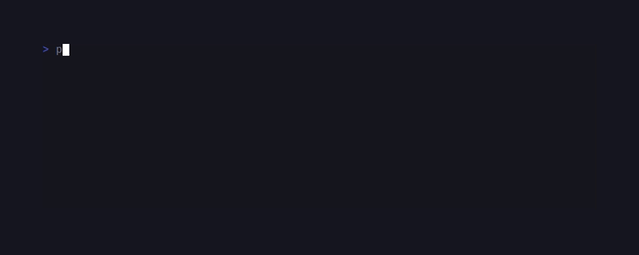

# CandyFreeze



PHP port of [charmbracelet/freeze](https://github.com/charmbracelet/freeze) —
turn code or terminal output into an SVG screenshot. **No `ext-gd` /
Imagick required**; the output is plain text suitable for git diffs and
CI artifacts.

```sh
composer require candycore/candy-freeze
```

## CLI

```sh
echo "function hello() { return 'world'; }" \
    | candyfreeze --theme dracula --line-numbers > out.svg

candyfreeze input.php \
    --theme tokyo-night --no-window --output screenshot.svg
```

Flags:
- `--theme {dark|light|dracula|tokyo-night|nord}` — colour palette.
- `--padding N` — content padding inside the frame.
- `--no-window` — drop the macOS-style traffic-light controls.
- `--no-shadow` — drop the SVG drop-shadow filter.
- `--no-border` — drop the frame outline.
- `--line-numbers` — render a left-gutter line counter.
- `--border-radius N` — corner radius of the frame.
- `-o`/`--output <path>` — write SVG to a file instead of stdout.

## Library

```php
use CandyCore\Freeze\SvgRenderer;

$svg = SvgRenderer::dracula()
    ->withLineNumbers(true)
    ->withWindow(true)
    ->withPadding(24)
    ->render($code);

file_put_contents('out.svg', $svg);
```

ANSI input is honoured — SGR foreground colours (16 / 256 / 24-bit truecolor)
plus bold / italic / underline become `<tspan>` segments in the output.

```php
$svg = SvgRenderer::dark()->render("\x1b[31merror:\x1b[0m something broke");
```

## Themes

```php
SvgRenderer::dark();        // charm-ish #0d1117
SvgRenderer::light();       // #f6f8fa
SvgRenderer::dracula();     // #282a36
SvgRenderer::tokyoNight();  // #1a1b26
SvgRenderer::nord();        // #2e3440
```

Build a custom theme via the `Theme` constructor — set background / foreground
/ border / shadow / line-number colour / window-control colours / font family
/ size / line height.

## Test

```sh
cd candy-freeze && composer install && vendor/bin/phpunit
```
