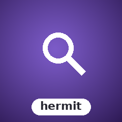

<!-- BADGES:BEGIN -->
[](https://github.com/detain/sugarcraft/actions/workflows/ci.yml)
[](https://app.codecov.io/gh/detain/sugarcraft?flags%5B0%5D=candy-hermit)
[](https://packagist.org/packages/sugarcraft/candy-hermit)
[](LICENSE)
[](https://www.php.net/)
<!-- BADGES:END -->

# CandyHermit

PHP port of [Genekkion/theHermit](https://github.com/Genekkion/theHermit) — fuzzy finder / quick-fix overlay for terminal UIs. Renders a filterable list overlay on top of a background view while the background continues to update.

## Install

```bash
composer require sugarcraft/candy-hermit
```

## Quick Start — string items

The simplest use case with plain string items:

```php
use SugarCraft\Hermit\Hermit;

// Items to filter
$items = ['apple', 'banana', 'cherry', 'date', 'elderberry'];

// Create hermit with items
$h = Hermit::new($items)
    ->setPrompt('> ')
    ->setItemFormatter(fn($item, $selected) => ($selected ? '*' : ' ') . " $item");

// Show and type to filter
$h = $h->show();
$h = $h->type('ba');  // filter by 'ba'

echo $h->View("background content\nmore background");

// Navigate
$h = $h->cursorDown();
$h = $h->cursorUp();

// Select
$selected = $h->selected();  // currently selected item (string in this mode)

// Hide
$h = $h->hide();
```

## Quick Start — numbered items with history

Use the `Item` interface + `FilteredItem` for numbered list items and persistent history:

```php
use SugarCraft\Hermit\Hermit;
use SugarCraft\Hermit\FilteredItem;
use SugarCraft\Hermit\History\FileHistory;

// Create numbered items
$items = [
    new FilteredItem(1, 'apple'),
    new FilteredItem(2, 'banana'),
    new FilteredItem(3, 'cherry'),
];

// Create hermit with Item[] and custom filter function
$h = Hermit::new($items)
    ->setFilterFn(fn($item): bool => $item->number() > 0)  // filter by custom predicate
    ->setPrompt('> ');

// Persist selections to JSONL file
$history = new FileHistory('/tmp/hermit_history.jsonl');
$history->append($h->selected());  // save selected item
$allItems = $history->all();      // load previous items
```

## Fuzzy ranking (candy-fuzzy)

By default the filter is anchor-aware contiguous-substring matching. Plug in a
[candy-fuzzy](../candy-fuzzy) ranker to switch to **true subsequence matching**,
ordering the list by descending fuzzy score and highlighting the scored runes:

```php
use SugarCraft\Hermit\Hermit;
use SugarCraft\Fuzzy\Matcher\SmithWatermanMatcher;

$h = Hermit::new($items)
    ->setRanker(new SmithWatermanMatcher())   // or any FuzzyMatcher
    ->setMatchStyle("\e[1m")
    ->show()
    ->type('tml');   // matches "terminal" (t·m·l subsequence), substring would miss it

// setRanker(null) restores the default substring filter.
```

A custom `setFilterFn()` predicate still applies on top of the ranker.

## Features

| Feature | Description |
|---------|-------------|
| **Fuzzy filtering** | Filter list items as you type with anchor-aware substring matching, or plug in a candy-fuzzy ranker via `setRanker()` for true subsequence scoring |
| **Overlay compositing** | Background view renders underneath; overlay chars replace background at specified positions |
| **Background continues updating** | The Hermit doesn't block the underlying view |
| **Fully styleable** | Custom filter prompt, item format, matching highlight, window dimensions |
| **Pure renderer** | No terminal I/O; output is strings you manage |
| **Item interface** | Work with structured `Item` objects instead of raw strings |
| **Persistent history** | `FileHistory` stores items as JSONL for session persistence |
| **Custom filter predicates** | `setFilterFn()` lets you filter items by arbitrary criteria |
| **Border & Style composition** | `withBorder()` and `withStyle()` compose `candy-sprinkles` `Border` and `Style` for window decoration |
| **HelpBar / StatusBar** | `withHelpBar()` and `withStatusBar()` attach keyboard-shortcut and status-line renders below the overlay |
| **SIGWINCH resize** | `withOnResize()` + `attachSigwinch()` forwards terminal resize events via `SignalForwarder::attachSigwinchToFd` |

## Architecture

```
SugarCraft\Hermit
├── Hermit              — Fuzzy finder overlay (main class)
├── Item                — Interface for filterable items
├── FilteredItem        — Numbered item implementation of Item
├── HelpBar             — Keyboard shortcut summary line
├── StatusBar           — Status message line with optional segments
└── History
    └── FileHistory     — JSONL-backed persistent history
```

## API — Hermit factory

```php
// Create with items (string[] or Item[])
public static function new(array $items = [], ?\Closure $itemFormatter = null): self
```

## API — Hermit configuration (fluent setters)

```php
// Set items (string[] or Item[]) and reset filter state
public function withItems(array $items): self

// Configure the filter prompt
public function setPrompt(string $prompt): self

// Set ANSI SGR codes for matched character highlighting (e.g. "\e[33m")
public function setMatchStyle(string $ansiStyle): self

// Set overlay window height (number of visible items)
public function setWindowHeight(int $h): self

// Set overlay window width (0 = auto-computed from prompt + items)
public function setWindowWidth(int $w): self

// Position the overlay at (x, y); also shows the hermit
public function setOffset(int $x, int $y): self

// Custom item formatter: Closure(item, isSelected): string
// For string items the closure receives (string $item, bool $isSelected)
public function setItemFormatter(\Closure $fn): self

// Custom filter predicate: Closure(Item $item): bool
// Applied after text-based fuzzy filtering; return false to exclude item
public function setFilterFn(\Closure $fn): self

// Plug in a candy-fuzzy ranker (null restores the default substring filter).
// When set, a non-empty filter ranks items by descending fuzzy score (true
// subsequence matching) and highlighting follows the scored indices.
public function setRanker(?\SugarCraft\Fuzzy\FuzzyMatcher $matcher): self

// Apply a candy-sprinkles Border to the overlay window
public function withBorder(?\SugarCraft\Sprinkles\Border $border): self

// Apply a candy-sprinkles Style to the overlay window
public function withStyle(?\SugarCraft\Sprinkles\Style $style): self

// Attach a HelpBar (keyboard shortcut summary) below the filter list
public function withHelpBar(?HelpBar $helpBar): self

// Attach a StatusBar (status message line) at the bottom of the overlay
public function withStatusBar(?StatusBar $statusBar): self

// Register a callback invoked after SIGWINCH resize events (cols, rows)
public function withOnResize(?\Closure $callback): self

// Attach SIGWINCH handler via SignalForwarder::attachSigwinchToFd (requires ext-pcntl)
public function attachSigwinch(): bool
```

## API — Hermit state mutations

```php
// Show the overlay and reset cursor/filter
public function show(): self

// Hide the overlay
public function hide(): self

// Append a character to the filter text and re-filter
public function type(string $char): self

// Remove last character from filter text
public function backspace(): self

// Clear filter text and show all items
public function clear(): self

// Move cursor up (default 1)
public function cursorUp(int $n = 1): self

// Move cursor down (default 1)
public function cursorDown(int $n = 1): self

// Jump to first item
public function cursorTop(): self

// Jump to last item
public function cursorBottom(): self
```

## API — Hermit queries

```php
public function isShown(): bool       // Whether overlay is visible
public function cursor(): int        // Current 0-based cursor index
public function filterText(): string // Current filter string
public function selected(): ?Item   // Currently selected Item (or null)
public function items(): array       // Filtered items (list<Item>)
public function itemCount(): int      // Number of visible (filtered) items
public function allCount(): int      // Total number of items
public function border(): ?\SugarCraft\Sprinkles\Border
public function style(): ?\SugarCraft\Sprinkles\Style
public function helpBar(): ?HelpBar
public function statusBar(): ?StatusBar
public function onResize(): ?\Closure  // Registered resize callback (cols, rows)
```

## API — Item interface

```php
use SugarCraft\Hermit\Item;
use SugarCraft\Hermit\FilteredItem;

// Item contract
interface Item {
    public function number(): int;  // 1-based ordinal for display
    public function value(): string; // Display text
}

// Numbered item implementation
final readonly class FilteredItem implements Item {
    public function __construct(private int $number, private string $value) {}
    public function number(): int { return $this->number; }
    public function value(): string { return $this->value; }
}
```

## API — FileHistory

```php
use SugarCraft\Hermit\History\FileHistory;
use SugarCraft\Hermit\FilteredItem;

// Create history at a file path (file is created on first append)
$history = new FileHistory('/tmp/my_history.jsonl');

// Append an Item (stored as JSON line: {"n":1,"v":"apple"}\n)
$history->append(new FilteredItem(1, 'apple'));

// Read all items back
$items = $history->all();  // returns list<Item>

// Clear the history file
$history->clear();

// Get the history file path
$path = $history->path();
```

## API — HelpBar

```php
use SugarCraft\Hermit\HelpBar;

// Create with optional shortcuts
$bar = new HelpBar([
    '↑↓' => 'navigate',
    'Enter' => 'select',
    'Esc' => 'close',
]);

// Add or remove shortcuts (fluent)
$bar = $bar->withShortcut('Ctrl+R', 'reload')
           ->withoutShortcut('↑↓');

// Show or hide
$bar = $bar->show();
$bar = $bar->hide();

// Render: "↑↓: navigate │ Enter: select │ Esc: close"
echo $bar->render();
```

## API — StatusBar

```php
use SugarCraft\Hermit\StatusBar;

// Create with optional message
$bar = new StatusBar('3 of 12 items');

// Fluent setters
$bar = $bar->withMessage('Searching...')
           ->withNoMessage()          // clear the message
           ->withSegment('count', '7') // named segment
           ->withoutSegment('count');

// Show or hide
$bar = $bar->show();
$bar = $bar->hide();

// Render: "[count: 7] Searching..."
echo $bar->render();
```

## SIGWINCH Resize

```php
use SugarCraft\Hermit\Hermit;

$h = Hermit::new($items)
    ->withOnResize(function (int $cols, int $rows): void {
        echo "Terminal resized to {$cols}x{$rows}\n";
    })
    ->attachSigwinch();  // installs SIGWINCH handler; returns bool
```

## Model Interface

Implement the `Model` interface to use Hermit inside a larger Bubble-Tea-style application:

```php
use SugarCraft\Hermit\Hermit;
use SugarCraft\Hermit\Model;

class MyModel implements Model {
    public function update(Hermit $hermit, string $msg): Model { ... }
    public function view(Hermit $hermit): string { ... }
}
```

## Upstream

Mirrors [Genekkion/theHermit](https://github.com/Genekkion/theHermit) — fuzzy finder / quick-fix overlay.

## License

[MIT](LICENSE)
