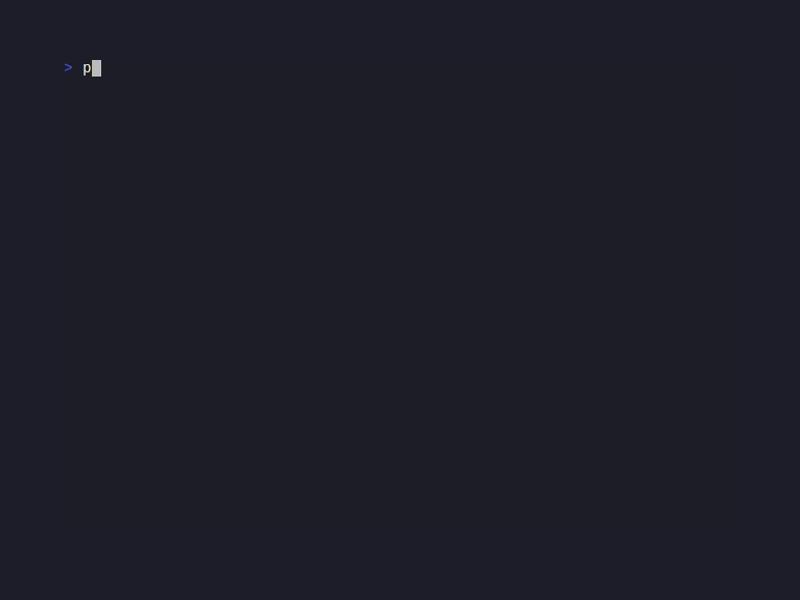

# CandyKit

<!-- BADGES:BEGIN -->
[](https://github.com/detain/sugarcraft/actions/workflows/ci.yml)
[](https://app.codecov.io/gh/detain/sugarcraft?flags%5B0%5D=candy-kit)
[](https://packagist.org/packages/sugarcraft/candy-kit)
[](LICENSE)
[](https://www.php.net/)
<!-- BADGES:END -->



```sh
composer require sugarcraft/candy-kit
```

PHP port of [charmbracelet/fang](https://github.com/charmbracelet/fang) —
opinionated **CLI presentation helpers** that turn ordinary command-
line output into something that matches the rest of the SugarCraft
stack. CandyKit is library-only — drop it into any Composer project,
no Symfony Console requirement.

```php
use SugarCraft\Kit\StatusLine;
use SugarCraft\Kit\Banner;
use SugarCraft\Kit\Theme;

echo Banner::title('CandyApp', 'v0.1.0'), "\n\n";
echo StatusLine::info('connecting to https://example.com'), "\n";
echo StatusLine::success('done in 0.4s'), "\n";
echo StatusLine::warn('disk almost full'), "\n";
echo StatusLine::error('connection refused'), "\n";
```

## Components

- **`Theme`** — palette of `Sprinkles\Style` objects keyed by status
  level (success / error / warn / info / prompt / accent / muted).
  `Theme::ansi()` ships a sensible default; bring your own theme by
  passing styles to the constructor.
- **`StatusLine`** — `success` / `error` / `warn` / `info` static
  helpers returning a glyph + message string styled per the active
  theme.
- **`Banner`** — render a bordered title block with optional subtitle,
  rounded by default. Useful for app intros / `--version` output.
- **`Logo`** — ASCII-art logo renderer with `Logo::sugarcraft()` built-in
  preset and `Logo::fromAscii($art)` for custom art. Chain
  `->withColor($hex)` to apply foreground color.
- **`Section`** — styled section with title and body content, themeable.
- **`Stage`** — multi-section presentation container.
- **`HelpText`** — formatted help output.

## Demos

### CLI page


### Logo


### Section


### Stage


## Test

```sh
cd candy-kit && composer install && vendor/bin/phpunit
```

## Snapshot tests

Presenter output is pinned via `candy-testing`'s `assertGoldenAnsi` golden-file
snapshots. Any change to the ANSI slide output must be intentional — re-record the
fixture with `--update-golden` to accept a new canonical render.
