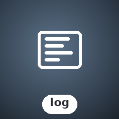

<!-- BADGES:BEGIN -->
[](https://github.com/detain/sugarcraft/actions/workflows/ci.yml)
[](https://app.codecov.io/gh/detain/sugarcraft?flags%5B0%5D=candy-log)
[](https://packagist.org/packages/sugarcraft/candy-log)
[](LICENSE)
[](https://www.php.net/)
<!-- BADGES:END -->

# CandyLog

PHP port of [charmbracelet/log](https://github.com/charmbracelet/log) — a minimal, colorful leveled logging library.

## Features

- **Leveled logging** — `Debug`, `Info`, `Warn`, `Error`, `Fatal` levels
- **Colorful human-readable output** — terminal-styled by default (Probe-driven: respects `NO_COLOR` / `FORCE_COLOR`)
- **Multiple formatters** — `TextFormatter` (default), `JSONFormatter`, `LogfmtFormatter`
- **Structured key/value pairs** — pass arbitrary context with every log call
- **Sub-loggers** — `with([...])` creates a child logger with persistent fields
- **Per-field styling** — `Styles::keys` maps field names to their ANSI styles
- **syslog-aligned levels** — integer values (-4/0/4/8/12) for easy threshold filtering
- **stdlog adapter** — wrap in `Log\StandardLogAdapter` for `*log.Logger` interface compatibility
- **PSR-3 bridge** — `PsrBridge` wrapper provides full PSR-3 `LoggerInterface` methods
- **Hook system** — register callbacks per log level via `HookRegistry::onLevel()`
- **Configurable log-part ordering** — `PartsOrder` DTO controls which parts appear and in what sequence

## Install

```bash
composer require sugarcraft/candy-log
```

## Quick Start

```php
use SugarCraft\Log\Logger;
use SugarCraft\Log\Level;

$log = Logger::new();
$log->info('Starting oven', ['degree' => 375]);
$log->warn('Almost ready', ['batch' => 2]);
$log->error('Temperature too low', ['err' => 'underheated']);
```

## Levels

Levels are syslog-aligned integers — use `->value` for threshold comparisons:

```php
Level::Debug->value; // -4
Level::Info->value;  //  0
Level::Warn->value;  //  4
Level::Error->value;  //  8
Level::Fatal->value;  // 12

$log->info('info message');
$log->warn('warn message');
$log->error('error message');
$log->fatal('fatal message'); // throws RuntimeException
$log->print('always prints');   // no level prefix
```

## Structured Fields

```php
$log->info('Baking cookies', [
    'flour' => '2 cups',
    'butter' => true,
    'temp' => 375,
]);

// Child logger with persistent fields
$baker = $log->with(['user' => 'chef', 'session' => 'am']);
$baker->info('Batch started'); // also has user + session
```

## Formatters

```php
use SugarCraft\Log\Formatter\TextFormatter;
use SugarCraft\Log\Formatter\JsonFormatter;
use SugarCraft\Log\Formatter\LogfmtFormatter;

$log = Logger::new(formatter: new JsonFormatter());
```

## Styling

Styles are applied automatically when the terminal supports color output.
Color is determined by `candy-palette`'s Probe — it respects the `NO_COLOR`
and `FORCE_COLOR` environment variables.

Override level styles via `Logger::styles()`:

```php
use SugarCraft\Sprinkles\Style;
$log = Logger::new();
$styles = $log->styles();
$styles->levels[Level::Error->value] = Style::new()->foreground('red')->bold();
$log->setStyles($styles);
```

### Per-field styles

`Styles::keys` maps field names (`time`, `level`, `prefix`, `caller`,
`message`, `key`, `value`) to individual `Style` objects:

```php
$styles = $log->styles();
$styles->keys['time']   = Style::new()->foreground('cyan');
$styles->keys['caller'] = Style::new()->foreground('grey');
$log->setStyles($styles);
```

### Level text alignment

`Styles::padLevelText($label)` right-pads a level label to 5 characters for
column-aligned log output:

```php
Styles::padLevelText('INFO');  // "INFO "
Styles::padLevelText('DEBUG'); // "DEBUG"
```

## Panic Handlers

```php
use SugarCraft\Log\Log;

// Install a panic handler that catches uncaught exceptions and fatal errors,
// restores the terminal from altscreen mode, and prints a styled panic report.
Log::installPanicHandler();

// Restore terminal state manually (exit altscreen, show cursor).
// Called automatically by the panic handler, but safe to call directly.
Log::restoreTerminal();
```

The panic handler catches uncaught exceptions and fatal errors (E_ERROR, E_PARSE), restores the terminal to a usable state, and prints a colorized banner with the exception class, message, and backtrace.

## PSR-3 Bridge

`PsrBridge` wraps a `Logger` instance and provides the full PSR-3 `LoggerInterface` API (`emergency`, `alert`, `critical`, `error`, `warning`, `notice`, `info`, `debug`, `log`). Use it anywhere a PSR-3 logger is expected:

```php
use SugarCraft\Log\Logger;
use SugarCraft\Log\PsrBridge;
use Psr\Log\LogLevel;

$logger = new Logger();
$psr = new PsrBridge($logger);

// All PSR-3 methods available
$psr->warning('Something is off', ['detail' => 'temperature rising']);
$psr->log(LogLevel::ERROR, 'Operation failed', ['code' => 500]);
```

The bridge also fires registered hooks before forwarding each message to the underlying logger, enabling middleware-style interceptors.

## Hook System

The hook system lets you register callbacks that fire whenever a log entry is emitted at or above a given level. Hooks receive the `Level`, PSR-3 level string, message, and context — useful for dispatching to external services, enriching context, or filtering.

> **Note:** Hooks fire **only via `PsrBridge`** — they do not fire when calling `Logger->info()` etc. directly. For the plain `Logger` API, hooks are not invoked. To use hooks, wrap your `Logger` in a `PsrBridge` and call methods on the bridge.

```php
use SugarCraft\Log\Logger;
use SugarCraft\Log\Level;
use SugarCraft\Log\Hook\HookRegistry;

$logger = new Logger();
$hooks = new HookRegistry();

// Register a callback for all Warn-and-above entries
$id = $hooks->onLevel(Level::Warn, function (Level $level, string $psrLevel, string $message, array $context) {
    // Dispatch to external service, enrich context, etc.
    file_put_contents('/tmp/warn.log', "[{$level->label()}] {$message}\n", FILE_APPEND);
});

// Pass hooks to the PsrBridge, or fire them manually
$hooks->fire(Level::Warn, 'warning', 'Something is off', []);
```

`HookRegistry::onLevel(Level, callable)` returns a registration ID. `HookRegistry::fire(Level, psrLevel, message, context)` dispatches to all handlers whose minimum level is met.

The `Hook` interface is also available for structured implementations:

```php
use SugarCraft\Log\Hook\Hook;
use SugarCraft\Log\Level;

final class MetricsHook implements Hook
{
    public function onLevel(Level $level, string $psrLevel, string $message, array $context): void
    {
        // Ship metrics to your observability platform
    }
}
```

## Parts Order

`PartsOrder` is a config DTO that controls which log-parts appear and in what sequence when formatting. It ships with three named presets:

```php
use SugarCraft\Log\PartsOrder;

// Default: timestamp level prefix? caller? message fields?
PartsOrder::default();   // [timestamp, level, prefix, caller, message, fields]

// Syslog-friendly: omits prefix and caller
PartsOrder::syslog();     // [timestamp, level, message, fields]

// Message-first: message comes before level and timestamp
PartsOrder::messageFirst(); // [message, level, timestamp, fields]

// Custom ordering
$order = new PartsOrder([PartsOrder::PART_MESSAGE, PartsOrder::PART_LEVEL, PartsOrder::PART_FIELDS]);

// Query whether a part is included
$order->has(PartsOrder::PART_CALLER); // false for syslog(), true for default()
```

Named part constants: `PART_TIMESTAMP`, `PART_LEVEL`, `PART_PREFIX`, `PART_CALLER`, `PART_MESSAGE`, `PART_FIELDS`.

## Caller Information

`CallerFormatter::find()` walks the call stack and returns `"file:line"` of the first frame outside the log package — the true call site:

```php
use SugarCraft\Log\CallerFormatter;

$caller = CallerFormatter::find(); // e.g. "my-script.php:42"
```

Used internally by formatters when `$reportCaller` is enabled on the `Logger`.

## License

[MIT](LICENSE)
