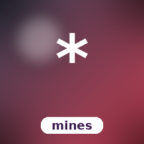

# CandyMines


Minesweeper on the SugarCraft stack — port of [`maxpaulus43/go-sweep`](https://github.com/maxpaulus43/go-sweep). Customisable board, recursive flood-fill, win / lose detection, vim-style movement.

## Run it

```bash
composer install
./bin/candy-mines [width] [height] [mines]   # defaults: 10 10 12
```

## Keys

| Key                | Action                |
|--------------------|-----------------------|
| `↑/↓/←/→` or `hjkl`| Move cursor           |
| `Space` / `Enter`  | Reveal cell           |
| `f`                | Toggle flag           |
| `r`                | Restart with new mines|
| `q` / `Esc`        | Quit                  |

## Architecture

Three pure-state classes plus the runtime Model and a one-pass renderer:

| File              | Role                                                                |
|-------------------|---------------------------------------------------------------------|
| `Cell`            | Value object — mine / revealed / flagged / adjacent count           |
| `Board`           | The grid + every transition (reveal, flag, flood-fill). PRNG injected as `Closure(int):int` for deterministic tests |
| `Game` (Model)    | Cursor + key routing + restart + win/lose gate                      |
| `Renderer`        | Pure view function. CandySprinkles `Style` + `Border::rounded()`    |

The first reveal is always safe — mines are placed only after click 1, with the clicked cell's 3×3 neighbourhood excluded so the player gets a non-trivial flood-fill on every game.

## Test

```bash
composer install
vendor/bin/phpunit
```
