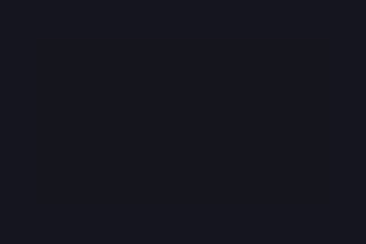

# CandyMines

<!-- BADGES:BEGIN -->
[](https://github.com/detain/sugarcraft/actions/workflows/ci.yml)
[](https://app.codecov.io/gh/detain/sugarcraft?flags%5B0%5D=candy-mines)
[](https://packagist.org/packages/sugarcraft/candy-mines)
[](LICENSE)
[](https://www.php.net/)
<!-- BADGES:END -->


Minesweeper on the SugarCraft stack — port of [`maxpaulus43/go-sweep`](https://github.com/maxpaulus43/go-sweep). Customisable board, recursive flood-fill, win / lose detection, vim-style movement.

Difficulty presets are available via `Game::withDifficulty(Difficulty::$LEVEL)` — `EASY` (9×9, 10 mines), `MEDIUM` (16×16, 40 mines), `EXPERT` (30×16, 99 mines).

## Run it

```bash
composer install
./bin/candy-mines [width] [height] [mines]   # defaults: 10 10 12
```

## Keys

| Key                | Action                           |
|--------------------|----------------------------------|
| `↑/↓/←/→` or `hjkl`| Move cursor                      |
| `Space` / `Enter`  | Reveal cell                      |
| `f`                | Toggle flag                      |
| `c` / middle-click  | Chord — reveal safe neighbors     |
| `r`                | Restart with new mines           |
| `q` / `Esc`        | Quit                             |

## Architecture

Five pure-state classes plus the runtime Model, renderer, UI helper, and persistence:

| File                    | Role                                                                                              |
|-------------------------|----------------------------------------------------------------------------------------------------|
| `Cell`                  | Value object — mine / revealed / flagged / adjacent count                                          |
| `Board`                 | The grid + every transition (reveal, flag, flood-fill, chord). Win detection is O(1) via `revealedCount` counter. Serialises to versioned JSON for mid-game save/load. |
| `Game` (Model)          | Cursor + key routing + restart + win/lose gate + sub-second timer (`microtime(true)`)             |
| `Stats`                 | Immutable difficulty stats — games, wins, best time per preset                                    |
| `DifficultyStats`       | Atomic JSON persistence wrapper (tmp+rename, Homestead pattern)                                   |
| `Ui/CustomDifficulty`   | Validated custom board dimensions — rows (2–50), cols (2–50), mines (1 to rows×cols−9). Throws i18n-aware `InvalidArgumentException` on constraint violation. |
| `Renderer`              | Pure view function. CandySprinkles `Style` + `Border::rounded()`                                   |

The first reveal is always safe — mines are placed only after click 1, with the clicked cell's 3×3 neighbourhood excluded so the player gets a non-trivial flood-fill on every game.

**Chord click** (`c` / middle-click): when a revealed number has exactly the right number of flagged neighbours, chord-clicking it safely reveals all remaining neighbours. This mirrors the standard left+right simultaneous press in classic minesweeper.

**O(1) win detection**: `Board::isWon()` compares `revealedCount` (the number of non-mine cells revealed) against `width × height − mineCount`. Win detection is constant-time regardless of board size — no full-grid scan on every move.

**Save / restore mid-game**: `Board::serialize()` produces a versioned JSON payload (`{v:1, w, h, m, p, e, r, c}`) covering every cell and board state. `Board::unserialize()` reconstructs an identical `Board` instance so sessions can be suspended and resumed.

## Demos

### Gameplay


### Flagging



## Shared foundations

The minefield renderer builds output via [candy-buffer](https://github.com/detain/sugarcraft/tree/master/candy-buffer) — each cell is zone-tagged via `Mark::zone("cell:$row:$col", $glyph)` so `Scanner::hit($x, $y)` maps directly to a cell address. `Renderer::resolveClick()` bridges mouse coordinates to row/col. Snapshot tests via [candy-testing](https://github.com/detain/sugarcraft/tree/master/candy-testing) pin canonical game states (first-click safe area, cascade reveal, win overlay).

## Test

```bash
composer install
vendor/bin/phpunit
```
