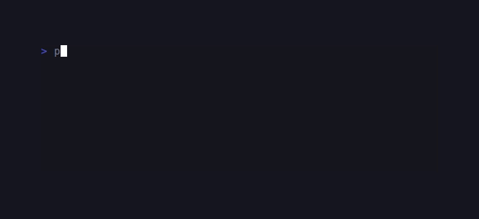
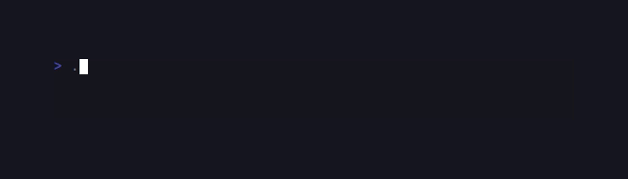
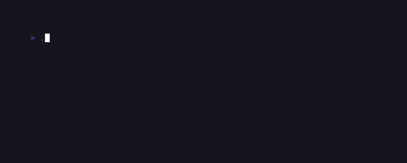

# CandyShell

<!-- BADGES:BEGIN -->
[](https://github.com/detain/sugarcraft/actions/workflows/ci.yml)
[](https://app.codecov.io/gh/detain/sugarcraft?flags%5B0%5D=candy-shell)
[](https://packagist.org/packages/candycore/candy-shell)
[](LICENSE)
[](https://www.php.net/)
<!-- BADGES:END -->


PHP port of [charmbracelet/gum](https://github.com/charmbracelet/gum) —
a composer-installable CLI of CandyCore TUI primitives, useful for
shell scripts.

```sh
# Apply styling.
candyshell style --foreground "#ff5f87" --bold "Hello, candy!"

# Pick one item.
choice=$(candyshell choose Pizza Burger Salad)

# Read a single line.
name=$(candyshell input --placeholder "Your name?")

# Confirm a destructive action.
candyshell confirm "Really delete $file?" && rm "$file"
```

## Subcommands (MVP)

- `style`   — apply Sprinkles styling to its argv (or stdin) and print.
- `choose`  — select one item from a list; prints the selection.
- `input`   — read a single line from the user.
- `confirm` — yes/no; exit code `0` on yes, `1` on no.

## Roadmap (post-v0)

- `spin`     — show a spinner while running an external command.
- `filter`   — fuzzy filter over stdin lines.
- `format`   — render Markdown / templates.
- `pager`    — scroll long input.
- `table`    — render a CSV / TSV table.
- `write`    — multi-line text editor.
- `file`     — file picker.
- `log`      — leveled logging output.
- `join`     — string join.

## Test

```sh
cd candy-shell && composer install && vendor/bin/phpunit
```

## Demos

### choose


### Confirm


### file


### filter



### format


### Input



### join


### log



### pager


### spin


### Style


### Table


### write


