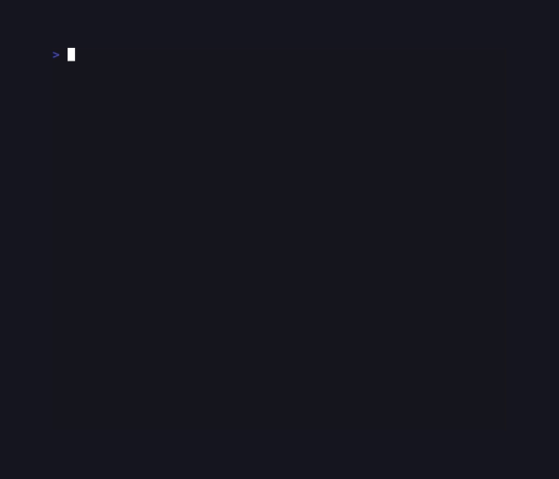
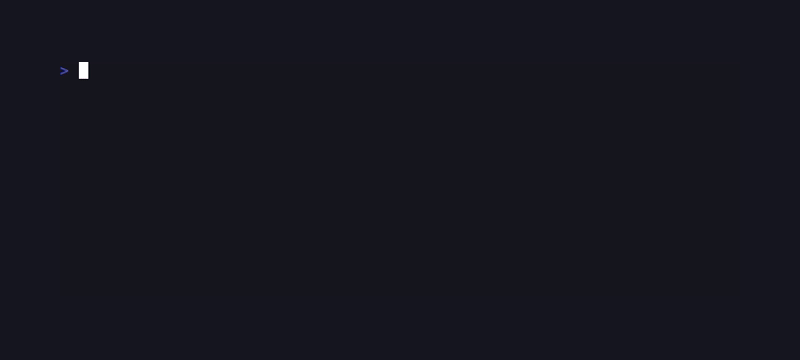
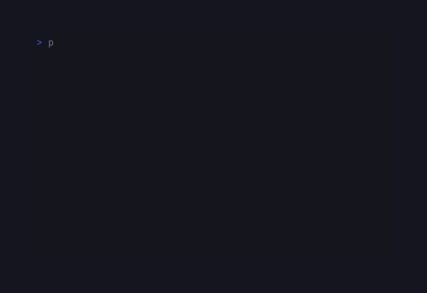
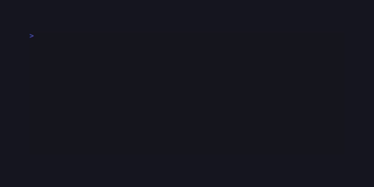
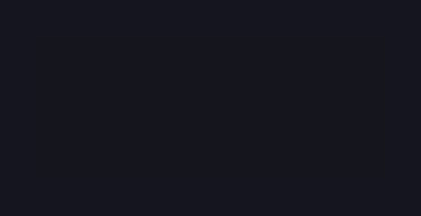
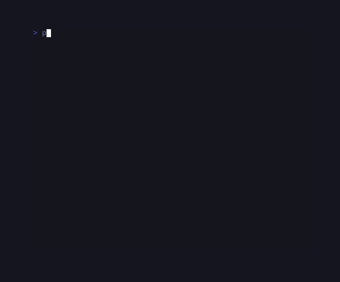

# CandySprinkles

<!-- BADGES:BEGIN -->
[](https://github.com/detain/sugarcraft/actions/workflows/ci.yml)
[](https://app.codecov.io/gh/detain/sugarcraft?flags%5B0%5D=candy-sprinkles)
[](https://packagist.org/packages/sugarcraft/candy-sprinkles)
[](LICENSE)
[](https://www.php.net/)
<!-- BADGES:END -->


PHP port of [charmbracelet/lipgloss](https://github.com/charmbracelet/lipgloss) —
declarative styling and layout for terminal UIs.

```sh
composer require sugarcraft/candy-sprinkles
```

## Quickstart

```php
use SugarCraft\Sprinkles\Style;

echo Style::new()
    ->bold()
    ->fg('#ff5f87')        // accepts hex string or Color instance
    ->on('#1e1e2e')        // background — reads naturally in chains
    ->pad(0, 2)            // CSS-style 1/2/4-arg padding
    ->of('hello, candy world')
    ->render() . "\n";
```

`fg` / `bg` / `on` / `pad` / `mg` / `of` are short-form ergonomic aliases.
The upstream-mirroring full names (`foreground` / `background` / `padding`
/ `margin` / `setString`) work identically — pick whichever reads better at
the call site:

```php
use SugarCraft\Core\Util\Color;

echo Style::new()
    ->bold()
    ->foreground(Color::hex('#ff5f87'))
    ->background(Color::hex('#1e1e2e'))
    ->padding(0, 2)
    ->setString('hello, candy world')
    ->render() . "\n";
```

## Layout helpers

```php
use SugarCraft\Sprinkles\Layout;
use SugarCraft\Sprinkles\Position;

// Side-by-side
echo Layout::joinHorizontal(Position::TOP, $left, $right);

// Side-by-side with 2-cell gap between blocks
echo Layout::joinHorizontalWithSpacing(Position::TOP, 2, $left, $right);

// Top-down
echo Layout::joinVertical(Position::LEFT, $header, $body, $footer);

// Top-down with 1-line gap between blocks
echo Layout::joinVerticalWithSpacing(Position::LEFT, 1, $header, $body, $footer);

// Place inside a fixed rectangle
echo Layout::place(40, 10, Position::CENTER, Position::CENTER, 'centered text');
```

## Constraint-based layout

The `Layout` sub-namespace provides a ratatui-inspired constraint solver
that partitions a terminal region into rows or columns:

```php
use SugarCraft\Sprinkles\Layout\Constraint;
use SugarCraft\Sprinkles\Layout\Layout;
use SugarCraft\Sprinkles\Layout\Rect;

// Split a 80×24 area into 3 horizontal rows
$rows = Layout::vertical([
    Constraint::length(3),   // header — fixed 3 rows
    Constraint::min(15),     // body   — at least 15 rows, grows with slack
    Constraint::length(1),   // footer — fixed 1 row
])->split(Rect::fromSize(80, 24));

// Further split the body row into 3 columns
$cols = Layout::horizontal([
    Constraint::length(20),     // sidebar — fixed 20 cols
    Constraint::percentage(60), // main    — 60% of remaining
    Constraint::fill(1),        // extra   — absorbs the rest
])->split($rows[1]);
```

Available constraints mirror ratatui:

| Constraint | Behaviour |
|---|---|
| `Constraint::length($n)` | Fixed character-cell count |
| `Constraint::min($n)` | At least `$n` cells; takes more if space is available |
| `Constraint::max($n)` | Upper-bound cap; reclaimed space redistributed to other constraints |
| `Constraint::percentage($n)` | `$n`% of the total area (0–100) |
| `Constraint::ratio($num, $denom)` | Proportional size as `$num/$denom` of the area |
| `Constraint::fill($weight)` | Fills all remaining space; weight controls distribution |

The solver handles all combinations of constraints in a single pass.
See `examples/constraint-dashboard.php` for a full 3-pane dashboard demo.

## Tables

```php
use SugarCraft\Sprinkles\Border;
use SugarCraft\Sprinkles\Table\Table;
use SugarCraft\Sprinkles\Style;

$styled = Table::new()
    ->headers('Name', 'Age')
    ->row('Alice', '30')
    ->row('Bob',   '25')
    ->border(Border::rounded())
    ->styleFunc(static fn(int $row, int $col): Style
        => $row === Table::HEADER_ROW
            ? Style::new()->bold()
            : Style::new())
    ->render();
echo $styled;
```

## Trees & lists

```php
use SugarCraft\Sprinkles\Listing\{Enumerator, ItemList};
use SugarCraft\Sprinkles\Tree\Tree;

echo ItemList::new()
    ->items(['Apples', 'Bananas', 'Cherries'])
    ->enumerator(Enumerator::roman())
    ->render();

echo Tree::new()
    ->root('Documents')
    ->child(Tree::new()->root('Travel')->child('Italy.md')->child('Japan.md'))
    ->child('Resume.pdf')
    ->render();
```

## Public API

- **`Theme`** — 10 named factories (`dark()` / `light()` / `dracula()` / `tokyoNight()` / `oneDark()` / `githubDark()` / `solarizedDark()` / `solarizedLight()` / `ansi()` / `adaptive()`) and 13 colour slots (`foreground` / `background` / `primary` / `secondary` / `accent` / `muted` / `error` / `warning` / `success` / `info` / `border` / `separator` / `cursor`). `accent`/`muted` default to `primary`/`secondary` in the `dark()`/`light()`/`ansi()` themes, but are set to distinct colour values in the richer named themes (dracula, tokyoNight, oneDark, githubDark, solarizedDark/Light); consumers must NOT assume `$theme->accent === $theme->primary`. Every `with*($color)` setter returns a new `Theme`. `Theme::catalog()` enumerates the factory names as a `list<string>` for programmatic discovery. SSOT for theming across consumer libs (sugar-dash, sugar-charts in Phase 03).
- **`Style`** — every lipgloss prop (~40 `with*()` methods): fg/bg/border
  colours (incl. per-side), bold/italic/underline/strikethrough/faint/blink/
  rapidBlink/reverse, padding/margin (1/2/4-arg shorthand + per-side), width/height,
  maxWidth/maxHeight, align (Align/VAlign), inline, transform, tabWidth,
  marginBackground, colorWhitespace. Plus 21 getters, 15 `unset*()`,
  `copy()` (shallow clone), `inherit($parent)` (unset-only merge), and
  `patch($other)` (incremental merge — only props set in $other are applied).
- **`Border`** — `normal()`, `rounded()`, `thick()`, `double()`, `block()`,
  `ascii()`, `hidden()`, `markdownBorder()`. `Border::catalog()` enumerates the
  factory names as a `list<string>` for programmatic discovery. Per-side toggles
  via `Style::border*`.
- **`BorderGradientBlend`** — `fromColors(Color ...$colors)` accepts 1–5
  colors and returns a blend whose `sides(): list<Color>` (top / right / bottom /
  left) are interpolated around the perimeter. Use with `Style::borderColor()`.
- **`AdaptiveColor` / `CompleteColor` / `CompleteAdaptiveColor`** — pick the
  right concrete colour at render time per `ColorProfile` (TrueColor / 256 /
  Ansi) or per dark-vs-light background.
- **`LightDark`** — pick helper for dark-bg vs light-bg colour schemes.
- **`Layout`** — `Place`, `PlaceHorizontal`, `PlaceVertical`,
  `JoinHorizontal`, `JoinVertical`, `JoinHorizontalWithSpacing`,
  `JoinVerticalWithSpacing`, `Width`, `Height`, `Size` (all package-level
  layout primitives from lipgloss).
- **`Position`** — `TOP / LEFT / CENTER / RIGHT / BOTTOM` floats for layout
  anchors.
- **`Layout`** (sub-namespace) — ratatui-inspired constraint solver:
  `Layout::horizontal($constraints)->split($area)` and
  `Layout::vertical($constraints)->split($area)` return `Rect[]`.
  Constraints: `Constraint::length/min/max/percentage/ratio/fill`.
  State: `Rect` (x, y, width, height) + `Direction` (Horizontal/Vertical).
- **`Listing\ItemList`** + **`Listing\Enumerator`** — bullet, dash, asterisk,
  arabic, alphabet, roman, romanUpper, decimal, none. Nested sublists +
  per-item style hooks.
- **`Tree\Tree`** + **`Tree\Enumerator`** — default / rounded / ascii
  connector sets; per-section style overrides; custom indenter.
- **`Table\Table`** — `headers` / `row(s)` / `border` / `align` /
  `headerAlign` / `rowAlign` / `styleFunc` / per-side border toggles /
  `width` / `offset` / `clearRows` / `data(Data)`.
- **`Table\Data`** — row-reader interface (`rows` / `columns` /
  `at($r, $c)`). Default impl `Table\StringData::fromMatrix(iterable)`.
- **`Output`** — top-level `print` / `println` / `sprint` / `printf` /
  `fprint($stream, …)` (style-agnostic).
- **`Renderer`** — per-writer rendering context: `withColorProfile` /
  `withHasDarkBackground` / `newStyle()` / `lightDark()` /
  `resolveAdaptive(AdaptiveColor)` / `fromEnvironment()`.
- **`Palette`** — named ANSI 16-slot constants (Black / Red / …
  BrightWhite) + `hasDarkBackground()` helper.
- **`UnderlineStyle`** — enum (None / Single / Double / Curly /
  Dotted / Dashed) for SGR `4:N` sub-style emit.
- **`Hsl`** — CSS-style HSL factory: `Hsl::color($h, $s, $l)` (hue 0-360,
  saturation/lightness 0-100) and `Hsl::parse('hsl(200,80%,50%)')` for
  string input.
- **`Markup`** — Rich-style `[tag]text[/]` parser returning `list<Cell>`.
  Distinct from `StyleParser` (which uses `[text](fg:red,bold)` syntax).
  Supports color names, fg:/bg: shortcuts, and bold/dim/italic/
  underline/reverse/strikethrough.

## Custom Renderer & color-profile

`Sprinkles\Renderer` bundles a colour profile + a dark-background
flag so you can branch behaviour without threading the values
through every `Style` call:

```php
$r     = Renderer::new()
    ->withColorProfile(ColorProfile::Ansi256)   // forced 256-colour
    ->withHasDarkBackground(false);              // light terminal
$style = $r->newStyle()->bold()->foreground(...);
$pick  = $r->lightDark();                        // closure(light, dark)
```

Each `Style` owns a `colorProfile()` setter too — the renderer is
just a convenience wrapper. `Renderer::fromEnvironment()` calls
`ColorProfile::detect()` for you (consults `NO_COLOR`,
`CLICOLOR_FORCE`, `TERM_PROGRAM`, etc.).

PHP's stream model is coarser than Go's, so the writer-binding
`NewRenderer(out)` shape is *not* mirrored. Pair with
`Output::fprint($stream, ...)` when you need to write to a
specific stream.

## Color blending utilities

`Util\Color` ships the lipgloss-equivalent helpers:

| Method | Returns |
|---|---|
| `Color::hex('#ff5f87')` | RGB |
| `Color::ansi(13)` | named ANSI slot |
| `Color::ansi256(213)` | xterm-256 |
| `Color::parse('cyan')` / `Color::parse('bright-red')` | lookup by CSS/ANSI name |
| `Color::hsl($h, $s, $l)` | from HSL (0-360, 0-1, 0-1) |
| `$c->blend($other, $t)` | linear LERP, t ∈ [0, 1] |
| `Color::blend1D($a, $b, int $steps)` | list of N stops |
| `Color::blend2D($tl, $tr, $bl, $br, $w, $h)` | 2D grid |
| `$c->lighten($amount)` / `darken($amount)` | luminance ±amount |
| `$c->alpha($amount)` | premultiply alpha onto a backdrop |
| `$c->complementary()` | hue + 180° |

Named ANSI slots live on `Sprinkles\Palette`:
`Palette::Red`, `Palette::BrightWhite`, etc. Use
`Palette::hasDarkBackground()` for a no-args terminal-detect.

## HSL colour factory

`Sprinkles\Hsl` provides CSS-style HSL colour construction:

```php
use SugarCraft\Sprinkles\Hsl;

// Factory: hue 0-360, saturation 0-100, lightness 0-100
$sky = Hsl::color(200.0, 80.0, 50.0);

// Parse from hsl() string — handles '%' suffixes and whitespace
$teal = Hsl::parse('hsl(174, 70%, 40%)');
$blue = Hsl::parse('hsl(240, 100%, 50%)');
```

## Inline markup parser

`Sprinkles\Markup` parses Rich-style `[tag]text[/]` markup into
`Cell` arrays — distinct from `StyleParser`'s `[text](fg:red,bold)`
syntax:

```php
use SugarCraft\Sprinkles\{Markup, Style};

$cells = Markup::parse('[bold]hello[/] world', Style::new());
$cells = Markup::parse('[red]error: [bold]oops[/][/]', Style::new());
$cells = Markup::parse('[fg:blue bg:yellow]blue on yellow[/]', Style::new());
```

Supported tags: colour names (black, red, green, yellow, blue,
magenta, cyan, white, bright-\*), bold, dim, italic, underline,
reverse, strikethrough, fg:color, bg:color.

## OSC-8 hyperlinks & underline styles

`Style::hyperlink($url)` wraps the rendered output in `\x1b]8;;URL…`
escapes; modern terminals turn it into a clickable link, the rest
fall through to plain text. Combine with `Style::underline()` +
`Style::underlineStyle(UnderlineStyle::Curly)` (the SGR `4:3`
sub-style) and `Style::underlineColor(Color::hex('#ff0000'))` to
emit a wavy red spell-check-style underline that degrades cleanly
to a plain SGR 4 underline on terminals that don't speak the
sub-style.

## Style copy-vs-inheritance

Every `with*()` setter returns a new `Style` — the receiver is
never mutated. `Style::copy()` returns a shallow clone for those
moments you want a known checkpoint to branch from.

`Style::inherit($parent)` merges *unset* props from the parent.
Inheritable properties: `bold` / `italic` / `underline` / `strike` /
`faint` / `blink` / `reverse` / `fg` / `bg` / `borderFg` / `borderBg`
(only if the child hasn't set them). Layout / structural properties
(width / height / padding / margin / border / borderSides) **don't**
inherit — every component is layout-independent. This matches
lipgloss v2's "explicit wins" rule.

## Theme — canonical colour palette

`Theme` is the single source of truth for terminal colour schemes
across SugarCraft consumer libs. Port of `charmbracelet/lipgloss.Theme`.

```php
use SugarCraft\Sprinkles\Theme;

// Pick a built-in theme
$dark = Theme::dark();
$tokyo = Theme::tokyoNight();
$dracula = Theme::dracula();

// Auto-detect from $COLORFGBG (falls back to dark)
$theme = Theme::adaptive();

// Enumerate every built-in theme name programmatically
$names = Theme::catalog(); // ['dark', 'light', 'dracula', …, 'adaptive']

// Override one or more colours (all with*() return new Theme)
$custom = $dark->withPrimary(Color::hex('#ff5f87'))
                ->withError(Color::ansi(1));

// Read colours
echo $custom->primary;   // Color('#ff5f87')
echo $custom->foreground; // Color('#c5c9d4') — kept from dark()
```

Available factories:

| Method | Palette |
|---|---|
| `Theme::dark()` | Dark, high-contrast |
| `Theme::light()` | Light theme |
| `Theme::dracula()` | Dracula |
| `Theme::tokyoNight()` | Tokyo Night |
| `Theme::oneDark()` | One Dark |
| `Theme::githubDark()` | GitHub Dark |
| `Theme::solarizedDark()` | Solarized Dark |
| `Theme::solarizedLight()` | Solarized Light |
| `Theme::ansi()` | Terminal ANSI 8-colour |
| `Theme::adaptive()` | Auto-detect via `COLORFGBG` env var |

All themes expose 13 colour slots: `foreground`, `background`,
`primary`, `secondary`, `accent`/`muted` (default to primary/secondary in basic
themes; distinct in richer named themes), `error`, `warning`, `success`,
`info`, `border`, `separator`, `cursor`.

## Measurement utilities

`Sprinkles\Layout` exposes the three measurement helpers from
lipgloss's package level:

- `Layout::Width($s)` — visible cell width of a (possibly
  ANSI-coloured, multibyte) string.
- `Layout::Height($s)` — number of `\n`-separated lines.
- `Layout::Size($s)` — `[width, height]` tuple.

All three strip ANSI escapes before measuring, honour East-Asian
wide cells, and round the same way `Style::render()` does — so
you can `Layout::Width($style->render('xx'))` to budget a
component's footprint reliably.

## Table StyleFunc + per-section borders

`Table::styleFunc(\Closure(int $row, int $col): Style)` runs once
per cell to pick its style. Row index `Table::HEADER_ROW` (constant
`-1`) identifies the header.

```php
$striped = Table::new()
    ->headers('Name', 'Score')
    ->rows([['Alice', '93'], ['Bob', '87']])
    ->styleFunc(static fn (int $r, int $c): Style =>
        $r === Table::HEADER_ROW
            ? Style::new()->bold()
            : ($r % 2 === 0 ? Style::new()->faint() : Style::new()),
    );
```

The four border-section flags (`borderHeader` / `borderRow` /
`borderColumn` / `borderTop/Right/Bottom/Left`) decide which
separators draw. Defaults: rounded outer + header rule + column
verticals; row separators off.

## Graceful colour degradation

A `Style` carries a `ColorProfile` (TrueColor / Ansi256 / Ansi /
NoTty). `render()` downsamples every colour to that tier before
emit:

```
TrueColor  → SGR 38;2;R;G;B  (24-bit)
Ansi256    → SGR 38;5;N      (xterm-256 nearest match)
Ansi       → SGR 30..37 / 90..97  (named slots)
NoTty      → no SGR at all   (clean text)
```

Use `Style::colorProfile(ColorProfile::Ansi)` for a forced
downgrade or `Renderer::fromEnvironment()` to auto-detect from
`NO_COLOR` / `CLICOLOR_FORCE` / `TERM` / `COLORTERM` /
`TERM_PROGRAM` / `WT_SESSION` / CI markers.

## Test

```sh
cd candy-sprinkles && composer install && vendor/bin/phpunit
```

## Demos

### Border styles



### Canvas (multi-layer compositor)



### Layout dashboard


### Constraint-based layout dashboard


### List



### Style



### Table



### Tree



