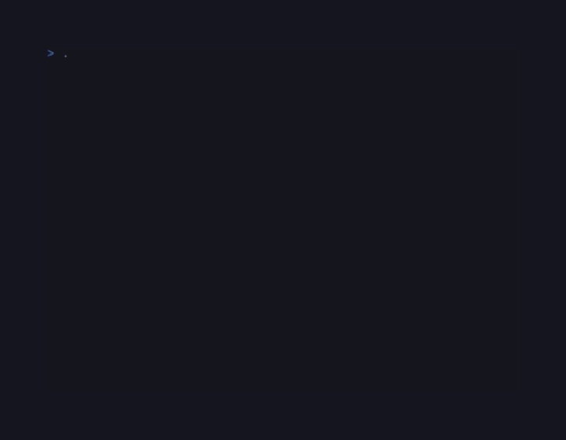
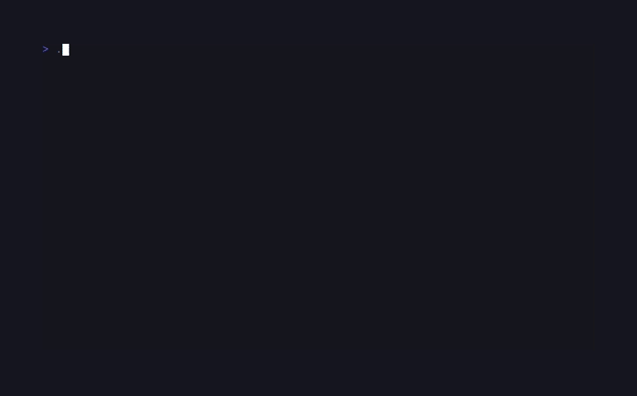

# CandyTetris

<!-- BADGES:BEGIN -->
[](https://github.com/detain/sugarcraft/actions/workflows/ci.yml)
[](https://app.codecov.io/gh/detain/sugarcraft?flags%5B0%5D=candy-tetris)
[](https://packagist.org/packages/sugarcraft/candy-tetris)
[](LICENSE)
[](https://www.php.net/)
<!-- BADGES:END -->




Tetris built on the SugarCraft stack. SugarCraft runtime, CandySprinkles for the rounded borders and per-piece colours, deterministic 7-bag RNG, ghost piece, hard drop, hold, level-driven gravity ramp, line-clear scoring.

## Run it

```bash
composer install
./bin/tetris         # Single player mode
./bin/tetris -v      # VS Computer mode
./bin/tetris --vs    # VS Computer mode (long form)
```

## VS Computer Mode

Compete against an AI opponent in split-screen mode. When you clear lines, garbage rows are sent to the computer. When the computer clears lines, garbage rows are sent to you. Last player standing wins!



### VS Mode Controls

| Key       | Action            |
|-----------|-------------------|
| ← / →     | Move left / right |
| ↑ / x     | Rotate clockwise  |
| z         | Rotate counter-cw |
| ↓         | Soft drop         |
| Space     | Hard drop         |
| p         | Pause / resume    |
| q         | Quit              |

The computer opponent uses weighted heuristics (board height, holes, gaps, lines) to make optimal moves.

## Controls

| Key       | Action            |
|-----------|-------------------|
| ← / →     | Move left / right |
| ↑ / x     | Rotate clockwise  |
| z         | Rotate counter-cw |
| ↓         | Soft drop         |
| Space     | Hard drop         |
| p         | Pause / resume    |
| q         | Quit              |

## Scoring (NES-classic)

| Lines cleared | Base points × (level + 1) |
|---------------|----------------------------|
| 1             | 40                         |
| 2             | 100                        |
| 3             | 300                        |
| 4 (Tetris)    | 1200                       |

Level rises every 10 lines. Gravity speeds up at every level — by level 9 pieces fall every 6 frames, by level 29+ they fall every frame. The frame-rate-agnostic `Score::framesPerRow()` is what the gravity tick consults.

## Architecture

Nine pure-state classes, each individually testable without booting the runtime:

```
Tetromino    enum   ─►  shape data + colour for each of the 7 pieces
Piece        VO     ─►  Tetromino + rotation + (x, y), with immutable transforms
Board        VO     ─►  10×24 grid (4 hidden rows above), fits/place/clearLines/dropPiece
Bag          ──►    7-bag RNG with peek(); injectable RNG closure for deterministic tests
Score        VO     ─►  points / lines / level + level-driven gravity interval
Game         Model  ─►  SugarCraft Model orchestrating the above + key handling
Computer     ──►    AI opponent with board-evaluation heuristics
VsGame       Model  ─►  VS mode combining two Games with garbage row passing
Renderer     ──►    pure view function from Game to frame string
VsRenderer   ──►    split-screen view for VS mode
```

Why so split? Because each piece is testable in isolation — line-clear correctness has nothing to do with rotation correctness has nothing to do with score arithmetic. The full test suite is **82 tests, 1669 assertions** and runs in ~300 ms; the deterministic RNG injection means even the `Game` integration tests are reproducible across runs.

## Status

Phase 9+ entry #19 — first cut. All standard SRS rules, ghost piece, level/gravity, scoring, and VS Computer mode with AI opponent. Wall-kicks are a tiny ±2 horizontal nudge rather than full SRS-spec; OK for v0.
