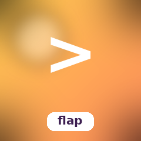
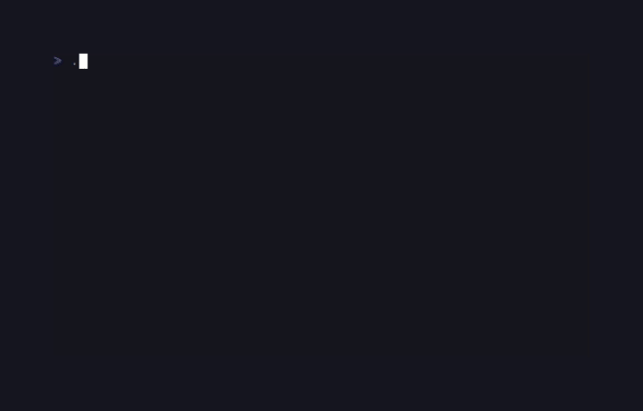

# HoneyFlap



Flappy-Bird-style game on the SugarCraft stack — port of [`kbrgl/flapioca`](https://github.com/kbrgl/flapioca). The bird's vertical motion is a HoneyBounce projectile (gravity + an upward velocity kick on each tap), pipes scroll left at a fixed cell rate, collision is per-cell.

## Run it

```bash
composer install
./bin/honey-flap
```

## Keys

| Key                | Action  |
|--------------------|---------|
| `Space` / `↑` / `w`| Flap    |
| `r`                | Restart |
| `q` / `Esc`        | Quit    |

## Architecture

| File            | Role                                                                           |
|-----------------|--------------------------------------------------------------------------------|
| `Bird`          | Wraps a HoneyBounce `Projectile` — gravity pulls it down, `flap()` resets vertical velocity to a fixed kick. |
| `Pipe`          | Single-column pipe pair with a centred gap. Slides left one cell per tick.     |
| `TickMsg`       | Frame-tick message scheduled by `Cmd::tick(0.033, …)` ≈ 30 fps.                |
| `Game` (Model)  | Pure-state world: bird + pipes + score + crashed flag. Injects PRNG closure for deterministic gap placements in tests. |
| `Renderer`      | Pure view — single playfield walk, ANSI-styled glyphs, rounded border.         |

The PRNG is injected as a `Closure(int $maxInclusive): int` so unit tests can pin the pipe layout to a specific sequence — the standard SugarCraft pattern.

## Test

```bash
composer install
vendor/bin/phpunit
```
