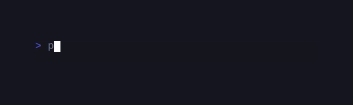

# SugarBits



PHP port of [charmbracelet/bubbles](https://github.com/charmbracelet/bubbles) —
14 pre-built TUI components for CandyCore.

```sh
composer require candycore/sugar-bits
```

## The 14 components

| Component | What it does |
|---|---|
| `Cursor\Cursor` | Animated text cursor with `BlinkMsg` tick |
| `Help\Help` | Render short / full key-help footer from a `KeyMap` |
| `Key\Binding` | One key + label + help row |
| `Spinner\Spinner` | Animated loading glyph — 12 styles (line, dot, miniDot, points, pulse, globe, meter, jump, moon, monkey, hamburger, ellipsis) |
| `Progress\Progress` | Static progress bar (gradient fill optional) |
| `Progress\AnimatedProgress` | Spring-physics-animated progress bar (HoneyBounce-driven) |
| `Timer\Timer` | Countdown timer |
| `Stopwatch\Stopwatch` | Elapsed-time counter |
| `TextInput\TextInput` | Single-line input with autocomplete + validators |
| `TextArea\TextArea` | Multi-line editor with line numbers + soft-wrap |
| `Viewport\Viewport` | Scrollable text region with mouse-wheel + scrollbar |
| `Paginator\Paginator` | Dot / arabic page indicator |
| `ItemList\ItemList` | Selectable / scrollable / filterable list with status messages |
| `Table\Table` | Selectable data table with `Column` struct + nav |
| `FilePicker\FilePicker` | Directory browser with icons / size / sort modes |

## Quickstart — TextInput with autocomplete

```php
use CandyCore\Bits\TextInput\TextInput;
use CandyCore\Core\{Cmd, Model, Msg, Program};
use CandyCore\Core\Msg\KeyMsg;
use CandyCore\Core\KeyType;

final class Search implements Model
{
    public function __construct(public readonly TextInput $ti) {}

    public function init(): ?\Closure { return null; }

    public function update(Msg $msg): array
    {
        if ($msg instanceof KeyMsg && $msg->type === KeyType::Enter) {
            return [$this, Cmd::quit()];
        }
        if ($msg instanceof KeyMsg && $msg->type === KeyType::Tab) {
            return [new self($this->ti->acceptSuggestion()), null];
        }
        [$ti, $cmd] = $this->ti->update($msg);
        return [new self($ti), $cmd];
    }

    public function view(): string
    {
        $body = $this->ti->view();
        if (($s = $this->ti->currentSuggestion()) !== null) {
            $body .= "\n  → $s";
        }
        return $body;
    }
}

[$ti, $cmd] = TextInput::new()
    ->withSuggestions(['apple', 'apricot', 'banana', 'cherry'])
    ->showSuggestions()
    ->withValidator(fn(string $v) => strlen($v) >= 2 ? null : 'too short')
    ->focus();

(new Program(new Search($ti)))->run();
```

## Quickstart — animated progress bar

```php
use CandyCore\Bits\Progress\AnimatedProgress;

$bar = AnimatedProgress::new()
    ->withWidth(40)
    ->withDefaultGradient();

[$bar, $cmd] = $bar->setPercent(0.75);
// dispatch $cmd via the Program — ticks re-fire from inside update()
// until the bar settles within 5e-4 of the target.
```

## Test

```sh
cd sugar-bits && composer install && vendor/bin/phpunit
```

## Demos

### Cursor


### File picker


### Help


### Item list


### Paginator


### Progress


### Spinners


### Stopwatch


### Table


### Text area


### Text input


### Timer


### Viewport


