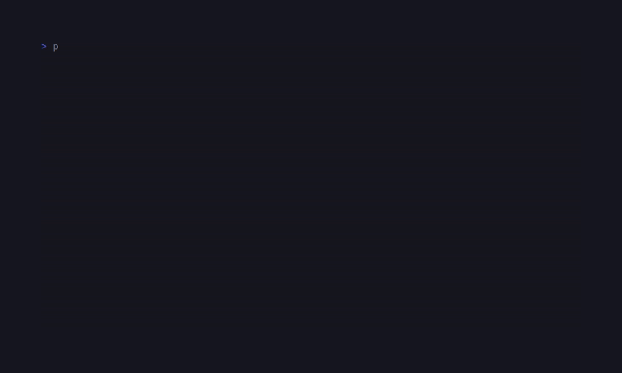

# SugarStash

<!-- BADGES:BEGIN -->
[](https://github.com/detain/sugarcraft/actions/workflows/ci.yml)
[](https://app.codecov.io/gh/detain/sugarcraft?flags%5B0%5D=sugar-stash)
[](https://packagist.org/packages/sugarcraft/sugar-stash)
[](LICENSE)
[](https://www.php.net/)
<!-- BADGES:END -->




Three-pane git TUI on the SugarCraft stack — port of [`jesseduffield/lazygit`](https://github.com/jesseduffield/lazygit). Status / branches / log laid out side-by-side, single-key stage / unstage, refresh, and ahead/behind branch summary.

```bash
composer require sugarcraft/sugar-stash
sugar-stash    # run inside any git working tree
```

## Keys

| Key                      | Action                                                  |
|--------------------------|---------------------------------------------------------|
| `Tab`                    | Cycle pane focus                                        |
| `↑/↓` or `k/j`           | Move cursor in active pane                             |
| `s` (status pane)        | Stage / unstage the highlighted entry                    |
| `a` (status pane)        | Stage all files                                         |
| `d` (status pane)        | Discard changes to the highlighted file                  |
| `P` (status pane)        | Open diff viewer for the highlighted file                |
| `Space` (branches pane)  | Checkout branch                                         |
| `c`                      | Commit (type message, Enter to confirm, Esc to cancel) |
| `A`                      | Amend last commit                                        |
| `n`                      | Create and switch to a new branch                        |
| `R`                      | Refresh from disk                                       |
| `?`                      | Context-sensitive help                                  |
| `q` / `Esc`              | Quit                                                    |

### Diff viewer keys

| Key              | Action                          |
|------------------|--------------------------------|
| `Space`          | Stage current hunk              |
| `↑/↓` or `k/j`   | Navigate between hunks         |
| `Esc`            | Close diff viewer              |

## Architecture

| File         | Role                                                                   |
|--------------|------------------------------------------------------------------------|
| `Git`        | Concrete `git` shell-out — `status --porcelain=v1 -b`, `for-each-ref`, `log --pretty=format:…`, `add`, `restore --staged`. Throws `RuntimeException` on non-zero exit. |
| `GitDriver`  | Interface for the four read methods + stage/unstage. Tests inject a fixture-backed driver so transition correctness is asserted without staging a real repo. |
| `Pane`       | Enum — `Status`, `Branches`, `Log` — with `next()` for Tab cycling.    |
| `App` (Model)| Owns the three lists + cursors + focus + error string. Pure-state — every key returns a fresh App. |
| `Renderer`   | Pure view function — three `Style::border(rounded)` panes joined horizontally / vertically; the focused pane gets a brighter accent. |

`SugarStash` is intentionally read-mostly: every git mutation that goes beyond stage / unstage shells out to `git` directly via the system, so users keep their existing aliases, hooks, and signing config. Anything more (interactive rebase, cherry-pick, bisect) belongs in a follow-up release.

## Internationalization

User-facing strings are internationalized via `SugarCraft\Stash\Lang::t()`.
All translatable strings live in `lang/en.php` under the `'stash'` namespace.

**Available keys** (`lang/en.php`):

| Key                    | Default string                                                    | Parameters  |
|------------------------|-------------------------------------------------------------------|------------|
| `git.spawn_failed`      | `git: failed to spawn`                                           | —          |
| `git.error`            | `git: {stderr}`                                                  | `{stderr}` |
| `cli.not_a_repo`       | `sugar-stash: not a git repository (no .git in {cwd})`             | `{cwd}`    |
| `ui.error_prefix`      | `error: `                                                        | —          |
| `status.clean`          | `clean working tree`                                            | —          |
| `branches.empty`       | `(no branches)`                                                  | —          |
| `log.empty`            | `(empty log)`                                                    | —          |
| `help.keyhints`         | `tab  switch pane  ·  j/k  move  ·  s  stage/unstage  ·  R  refresh  ·  q  quit` | —    |

To add a locale, copy `lang/en.php` to `lang/<code>.php` and translate the
values. The lookup chain follows `SugarCraft\Core\I18n\T`:
exact locale → base language → `en` → raw key.

**Using the facade:**

```php
use SugarCraft\Stash\Lang;

$msg = Lang::t('status.clean');                 // 'clean working tree'
$hint = Lang::t('help.keyhints');               // 'tab  switch pane  ·  ...'
$err = Lang::t('ui.error_prefix') . $error;     // 'error: <msg>'
```

**Adding new translatable strings:**

```php
// In any source file:
use SugarCraft\Stash\Lang;

// Simple key:
$msg = Lang::t('status.clean');

// With placeholder:
$msg = Lang::t('git.error', ['stderr' => $stderr]);
```

## Demos

### Staging workflow


## Test

```bash
composer install
vendor/bin/phpunit
```
