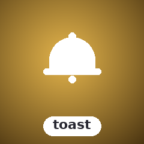

<!-- BADGES:BEGIN -->
[](https://github.com/detain/sugarcraft/actions/workflows/ci.yml)
[](https://app.codecov.io/gh/detain/sugarcraft?flags%5B0%5D=sugar-toast)
[](https://packagist.org/packages/sugarcore/sugar-toast)
[](LICENSE)
[](https://www.php.net/)
<!-- BADGES:END -->

# SugarToast

PHP port of [DaltonSW/bubbleup](https://github.com/daltonsw/bubbleup) — floating alert notification component for terminal UIs. Alerts float to the top of your TUI like bubbles in soda.

## Features

- **9 positions**: TopLeft, TopCenter, TopRight, MiddleLeft, MiddleCenter, MiddleRight, BottomLeft, BottomCenter, BottomRight
- **4 alert types**: Error, Warning, Info, Success — each with distinct styling
- **Dynamic width**: fixed or auto-sizing between minWidth and maxWidth
- **Symbol sets**: NerdFont (icons), Unicode (boxed), ASCII (plain text)
- **Auto-dismiss**: duration-based expiry support
- **Multiple alerts**: queue of toasts rendered in order
- **Progress toasts**: inline progress bar (0–100%) beneath the message body
- **Action buttons**: `[Label]` buttons attached to an alert with closure callbacks
- **History log**: immutable record of every dismissed alert
- **Fade animation stub**: `withAnimationDuration()` (CubicBezier deferred to future phase)
- **Pure renderer**: outputs ANSI strings; works with any TUI framework

## Install

```bash
composer require sugarcraft/sugar-toast
```

## Quick Start

```php
use SugarCraft\Toast\{Position, Toast, ToastType};

$toast = Toast::new(50)  // max width 50
    ->withPosition(Position::TopRight)
    ->withDuration(10.0);  // seconds

// Add alerts
$toast = $toast->alert(ToastType::Success, 'File saved!');
$toast = $toast->alert(ToastType::Error, 'Connection failed');

// Render into a viewport
$bg = str_repeat("background content\n", 20);
echo $toast->View($bg);
```

## Alert Types

```php
ToastType::Error
ToastType::Warning
ToastType::Info
ToastType::Success
```

Each type also provides a localized label via `ToastType::label()` (e.g.
`ToastType::Success->label()` → `"Success"` in English).

`alert()` accepts either a `ToastType` enum case or a lowercase string
(`"error"`, `"warning"`, `"info"`, `"success"`). Passing an unknown string
throws `InvalidArgumentException`.

## Positions

```php
Position::TopLeft
Position::TopCenter
Position::TopRight
Position::MiddleLeft
Position::MiddleCenter
Position::MiddleRight
Position::BottomLeft
Position::BottomCenter
Position::BottomRight
```

## Overflow & Concurrency

```php
Overflow::DropOldest  // remove oldest alert to make room (default)
Overflow::DropNewest  // discard the new alert instead of enqueueing
Overflow::Enqueue     // allow queue to exceed maxConcurrent
```

Control the maximum number of concurrent alerts with `withMaxConcurrent(int|null)`:
- Pass an integer to cap the queue size
- Pass `null` for unlimited (default)

When the cap is reached, the configured `Overflow` strategy determines behaviour.

## Persistent Alerts

By default, alerts inherit `withDuration()` for auto-dismiss timing. Pass
`null` as the `$expiresAt` argument to `alert()` to create a persistent alert
that never expires automatically:

```php
$toast = $toast->alert(ToastType::Info, 'Connected', null);  // never expires
```

Persistent alerts are dismissed only via `dismiss()`, `clear()`, or `pruneExpired()`.

## Loop integration

Expired alerts are removed by `pruneExpired()`, but something has to *call* it.
Rather than poll on a fixed interval, ask the toast when the next prune is due and
schedule a single timer for exactly that moment:

```php
$delay = $toast->secondsUntilNextExpiry();   // seconds until the soonest expiry, or null
if ($delay !== null) {
    // e.g. in a candy-core TEA app:
    $cmd = Cmd::tick($delay, fn () => new ToastTickMsg());
}

// when the tick fires:
$toast = $toast->pruneExpired();
if ($toast->hasActiveAlert()) {
    // reschedule for the next expiry, repeat
}
```

- **`nextExpiry(): ?float`** — the soonest expiry instant (seconds since epoch)
  among queued alerts that auto-dismiss, or `null` if none expire. May be in the
  past when an alert is already due.
- **`secondsUntilNextExpiry(): ?float`** — the same as a delay from now, clamped
  to `>= 0.0` (an already-due alert yields `0.0`), or `null` if nothing expires.

## Internationalization

User-facing strings are internationalized via `SugarCraft\Toast\Lang::t()`.
All translatable strings live in `lang/en.php` under the `'toast'` namespace.

**Available keys** (`lang/en.php`):

| Key              | Default string                    | Parameters   |
|------------------|-----------------------------------|--------------|
| `type.info`       | `Info`                            | —            |
| `type.warning`    | `Warning`                         | —            |
| `type.error`      | `Error`                           | —            |
| `type.success`    | `Success`                         | —            |
| `dismiss`        | `Press any key to dismiss`        | —            |
| `count`           | `{count} notification(s)`         | `{count}`    |

> **Note:** The `dismiss` and `count` keys are provided as convenience strings
> for host-rendered dismiss-hint and counter UI. They are **not** emitted or
> rendered by `View()` itself — the library outputs only the alert overlay.

To add a locale, copy `lang/en.php` to `lang/<code>.php` and translate the
values. The lookup chain follows `SugarCraft\Core\I18n\T`:
exact locale → base language → `en` → raw key.

**Using the facade:**

```php
use SugarCraft\Toast\Lang;
use SugarCraft\Toast\ToastType;

$label = ToastType::Error->label();        // 'Error' (i18n-aware)
$prompt = Lang::t('dismiss');            // 'Press any key to dismiss'
$counter = Lang::t('count', ['count' => 3]); // '3 notification(s)'
```

**Adding new translatable strings:**

```php
// In any source file:
use SugarCraft\Toast\Lang;

// Simple key:
$msg = Lang::t('dismiss');

// With placeholder:
$counter = Lang::t('count', ['count' => $n]);
```

## Progress Toasts

Add a progress bar beneath the message body using `progressToast()`:

```php
$toast = $toast->progressToast(ToastType::Info, 'Downloading...', 0.65);
// Re-render as progress updates:
$toast = $toast->progressToast(ToastType::Info, 'Downloading...', 0.80);
```

`progressToast()` accepts the same `$expiresAt` override as `alert()`. The
progress value (0.0–1.0) is clamped automatically.

## Action Buttons

Attach clickable buttons to an alert via `Alert::withActions()`:

```php
use SugarCraft\Toast\{Action, Toast, ToastType};

$action = Action::make('Retry', function (): void {
    // reconnect logic here
});

$alert = (new Alert(ToastType::Error, 'Connection lost'))
    ->withActions([$action]);

$toast = $toast->alert(ToastType::Error, 'Connection lost')
    ->withActions([$action]);
```

`Action` is a value object with `readonly string $label` and
`readonly \Closure(): void $callback`. When the action is triggered, invoke
`$action->callback()` directly in your key/mouse handler.

## History Log

`Toast` maintains an immutable history of every dismissed alert via
`HistoryLog`:

```php
// Dismiss all active alerts and record them
$toast = $toast->dismiss();

// Retrieve the log
$history = $toast->getHistory();  // list<Alert>

foreach ($history as $alert) {
    echo $alert->type->label() . ': ' . $alert->message . "\n";
}
```

`HistoryLog` is immutable — `dismiss()` returns a new `Toast` with an
updated log; prior instances are unchanged.

## Animations

```php
$toast = $toast->withAnimationDuration(0.25);
```

Set a fade animation duration in seconds. When > 0, toasts render a
character-reveal hint. Full CubicBezier spring easing (honey-bounce) is
wired but deferred — the `animationDuration` field is a functional stub
for now.

## API Summary

| Method | Description |
|--------|-------------|
| `Toast::new(int $maxWidth = 50)` | Factory |
| `->withPosition(Position)` | Screen position (9 positions) |
| `->withDuration(?float $seconds)` | Auto-dismiss after N seconds; `null` disables |
| `->withMaxWidth(int)` | Maximum alert width in cells |
| `->withMinWidth(int)` | Minimum alert width in cells |
| `->withSymbolSet(SymbolSet)` | NerdFont, Unicode, or ASCII symbols |
| `->withAllowEscToClose(bool)` | Preference flag the host reads to decide if Escape dismisses (the renderer does not handle input) |
| `->withMaxConcurrent(?int $n)` | Cap concurrent alerts (`null` = unlimited) |
| `->withOverflow(Overflow)` | Strategy when cap exceeded: DropOldest, DropNewest, Enqueue |
| `->withAnimationDuration(float $seconds)` | Fade animation duration (stub; CubicBezier deferred) |
| `->alert(ToastType\|string, string, ?float $expiresAt)` | Add alert (string type = case-insensitive) |
| `->progressToast(ToastType\|string, string, float $progress, ?float $expiresAt)` | Add alert with progress bar (0.0–1.0) |
| `->error/warning/info/success(string)` | Convenience alert helpers |
| `->hasActiveAlert(): bool` | True if non-expired alerts queued |
| `->nextExpiry(): ?float` | Soonest expiry instant (epoch seconds) of an auto-dismissing alert, or `null` |
| `->secondsUntilNextExpiry(): ?float` | Delay until the next expiry, clamped `>= 0.0`, or `null` — schedule one prune tick |
| `->dismiss() / clear() / pruneExpired()` | Manage alert lifecycle; `dismiss()` records to history |
| `->getHistory(): list<Alert>` | Return all dismissed alerts |
| `->view(string $background, int $w, int $h): string` | Render toast layer over background |

| Class | Method | Description |
|-------|--------|-------------|
| `Alert` | `withProgress(float)` | Attach progress bar (0.0–1.0, clamped) |
| `Alert` | `withActions(list<Action>)` | Attach action buttons |
| `Alert` | `isExpired(): bool` | Check expiry |
| `Alert` | `withExpiry(float $duration)` | Set expiry from now |
| `Action` | `make(string $label, \Closure(): void $callback)` | Factory |
| `Action` | `->label: non-empty-string` | Button label (readonly) |
| `Action` | `->callback: \Closure(): void` | Callback (readonly) |
| `HistoryLog` | `push(Alert): self` | Append alert, return new log |
| `HistoryLog` | `all(): list<Alert>` | Return all entries |
| `HistoryLog` | `count(): int` | Entry count |

| Enum | Cases |
|-------|-------|
| `Position` | TopLeft, TopCenter, TopRight, MiddleLeft, MiddleCenter, MiddleRight, BottomLeft, BottomCenter, BottomRight |
| `ToastType` | Error, Warning, Info, Success |
| `Overflow` | DropOldest, DropNewest, Enqueue |
| `SymbolSet` | NerdFont, Unicode, ASCII |

## Shared foundations

- **[candy-buffer](https://github.com/sugarcraft/candy-buffer)** — alert queue
  composited via `Buffer`; each toast is a sub-`Buffer` composited into the
  screen `Buffer` for per-cell positioning and overlap resolution.
- **[candy-testing](https://github.com/sugarcraft/candy-testing)** — golden-file
  snapshot tests via `assertGoldenAnsi()` pin canonical queue layouts.

## License

[MIT](LICENSE)
